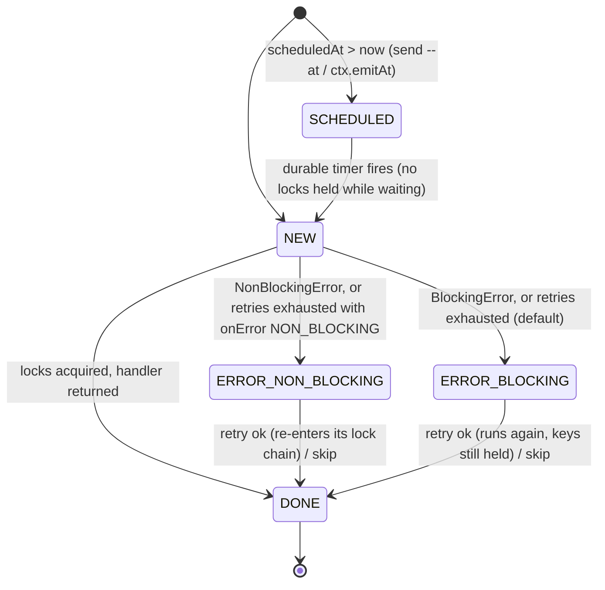

# concert-temporal

Low-latency state machine orchestration on [Temporal](https://temporal.io). Events arrive on Kinesis and are
deduplicated. Events that share a key are serialized, and an event can carry **several keys**. Each event is
then applied either to a per-entity state machine, whose data is a typed model generated from
[Legend Pure](https://github.com/finos/legend-pure), or (event style) by the handler of its event type, which can
save keyed state and emit follow-up events ([two processing styles](#two-processing-styles-entity-state-machines-and-event-handlers)). When an entity reaches a terminal state, its final snapshot
goes through Kafka into three analytics stores (DuckDB, ClickHouse, Deephaven), where it can be joined with
market data.

Everything runs as Temporal workflows and activities, including the "coordinator", the reconciliation job and
its schedule. There is no bespoke lease, peer or outbox protocol: failover, retries and durability are Temporal's.

* [Architecture](#architecture) · [Quickstart](#quickstart) · [Concepts](#concepts) ·
  [Guarantees per hop](#guarantees-per-hop) · [UIs and ports](#uis-and-ports) · [Scripts](#scripts-and-commands)
* [Analytics stores](#analytics-stores) · [Reconciliation, DLQ, metrics](#reconciliation-dead-letters-and-metrics) ·
  [Trading showcase](#trading-showcase) · [Benchmarks and chaos](#benchmarks-and-chaos) ·
  [Configuration](#configuration) · [Known limits](#known-limits) · [Module map](#module-map)

## Architecture

```
 producers ─▶ Kinesis concert-events
                │  ShardConsumer activity (1 per shard, heartbeating; checkpoint in heartbeat + StateStore)
                │  batch dedupe in the StateStore (INSERT … ON CONFLICT DO NOTHING / conditional put)
                ▼
 ┌──────────────────── Temporal (task queue "orchestration") ────────────────────┐
 │ KeyLockWorkflow lock:<K0> ─forward─▶ lock:<K1> ─ … ─▶ last key: UpdateWithStart │   FIFO per key, keys in
 │                                                    the entity's handle(event)  │   global sorted order
 └────────────────────────────────────────────────────────────────┬──────────────┘
                                                                  ▼
 ┌──────────── Temporal (task queue "sm-<type>", one per state machine type) ────────────┐
 │ EntityWorkflow <type>:<key>: transition (typed Pure model) → onTransition side effects  │
 │   → persist state/data/version ──────────────────────────────▶ StateStore               │
 │   → terminal state? EntitySnapshotPublisher activity           postgres | dsql |         │
 │ ReconcileWorkflow (Schedule reconcile-<type>, hourly)          dynamo | spanner          │
 └──────────────┬──────────────────────────────────────────────────────────────────────────┘
                ▼
 Kafka entity-snapshots (compacted, key = entity id) ──┬─▶ sink-duckdb ─▶ DuckDB file  (+ entity-snapshots.dlq)
                                                       ├─▶ ClickHouse Kafka engine ─▶ ReplacingMergeTree per type
                                                       └─▶ Deephaven (live tables, last_by per entity)
 marketdata-sim ─▶ Kafka ref.* / md.ticks / md.bars.1m ─┴─▶ ClickHouse, Deephaven   (side path, no concert)
                                                                          ▲
                                trace UI :8088 (entities, locks, Analytics tab: SQL consoles, pipeline strip)
```

## Quickstart

Requirements: Docker (about 14 GiB of memory for the full analytics profile) and JDK 25
(`/opt/homebrew/opt/openjdk@25`; scripts find it themselves).

```bash
scripts/up.sh spanner --analytics --trading       # platform + Kafka/DuckDB/ClickHouse/Deephaven + trading worker
./deploy-concert-ecosystem insurance --store spanner   # add the generated insurance ecosystem (worker + sink roots)
./showcases/insurance/send-flow all                # happy-path claims/policies/payouts through concert
scripts/trading-load.sh 100 50                     # 100 equity orders (routes, fills, allocations) at 50 events/s
open http://localhost:8088/#analytics              # trace UI: DuckDB / ClickHouse / Deephaven, pipeline strip
scripts/reconcile.sh --dry-run                     # StateStore vs DuckDB, per smType
```

`scripts/up.sh postgres|dynamo|spanner` picks the storage backend (see [Storage backends](#storage-backends)).
Without `--analytics`, workers drop snapshots (no Kafka) and everything else works the same.
`scripts/up.sh down` stops all profiles and keeps the volumes.

To build and test: `./gradlew build`. It runs the unit tests plus the Docker-based end-to-end tests, with zero
compiler warnings.

## Concepts

### Events, multi-key locks and ordering

An event names its entity (`smType` + `instanceKey`), its type, and the **lock keys** it must hold:

```json
{"eventId":"e-1","smType":"order","instanceKey":"123","eventType":"pay",
 "lockKeys":["account:9"],"payload":"{...}","sourceTsMillis":1759600000000}
```

* **Serialization.** Events sharing any key never run concurrently. Each key is a `KeyLockWorkflow` that
  serves a FIFO queue. A multi-key event acquires its keys in **global sorted order**, which makes it
  deadlock-free: the head of `lock:K0` forwards to `lock:K1`, and so on. On the last key, it applies the
  event to the entity with UpdateWithStart, then releases the other keys.
* **Ordering.** Per-shard order is kept on each event's *first sorted* key. Put the first sorted lock key in
  the Kinesis partition key. On a secondary key, a multi-key event can be overtaken by a later event whose
  first key that is (see [Known limits](#known-limits)).
* **Dedupe** happens at three levels: the StateStore's `processed_event` (batch claim per shard poll), lock
  request ids, and entity update ids. Redelivery from Kinesis, activity retries and coordinator failover
  are all no-ops.
* **Updates, not signals.** An update reaches the worker directly; a signal first goes through the history
  transfer queue. Measured here: signal → local activity p50 28 ms, update round trip p50 9 ms. Every lock
  interaction is an update.
* `DIRECT_SM_TYPES` lets types that never share keys bypass locks.

### State machines and typed models

A machine is a Temporal workflow class with a declarative transition table (`StateMachineSpec`). Typed
machines (`ModelStateMachine<D>`) keep their entity data as a class generated from a `.pure` model, by the
`model-codegen` annotation processor. Event payloads bind to per-transition payload classes. Multiplicities
are validated, so invalid data rejects the event and leaves state and version unchanged.

```java
@LegendModel(files = {"common.pure", "order.pure"}, root = "demo::order::Order")   // generates Order, PayCommand, ...
public class OrderStateMachine extends ModelStateMachine<Order> {
    static final StateMachineSpec SPEC = StateMachineSpec.startingAt("CREATED")
            .on("CREATED", "pay", "PAID", PayCommand.class)
            .on("PAID", "ship", "SHIPPED", ShipCommand.class)
            .on("SHIPPED", "deliver", "DELIVERED", DeliverCommand.class)
            .build();
    @Override protected StateMachineSpec spec() { return SPEC; }
    @Override protected Class<Order> dataType() { return Order.class; }
    @Override protected Order initialData(String key) { return new Order().setOrderId(key); }
    @Override protected void onTransition(String from, String to, Order o, Object payload, EventEnvelope e) {
        // mutate o; call activities for side effects (locks are held until this returns); reject(...) to refuse
    }
}
```

A state without outgoing transitions is **terminal**; `Builder.terminal(...)` declares terminal states
explicitly instead. Entering a terminal state publishes the entity's snapshot. `WorkerBootstrap.start(...)`
runs a type on task queue `sm-<type>`. Each module lists its machines through the `MachineCatalog` SPI, which
the trace UI and reconciliation use.

### Declaring machines in Pure (`concert::sm`) and the ecosystem generator

You can also declare whole state machines in the models, with the built-in `concert::sm` profile, and generate
a module from them. `core/ecosystem-gen/README.md` has the syntax and the file ownership rules.

```
Class <<concert::sm.root>>
{
  concert::sm.type = 'claim',
  concert::sm.transitions = 'NEW -file-> OPEN : FileClaim; OPEN -assess-> ASSESSED : AssessClaim;
                             ASSESSED -approve-> APPROVED : ApproveClaim; APPROVED -pay-> PAID : PayClaim',
  concert::sm.locks = 'file, approve: policy:{policyId}; pay: policy:{policyId}, payee:{payeeAccount}'
}
insurance::Claim { claimId: String[1]; status: ClaimStatus[1]; ... }
```

```bash
./generate-concert-ecosystem examples/insurance --name insurance   # validate (file:line:col errors) + write showcases/insurance
./deploy-concert-ecosystem insurance --store spanner              # build, compose up with its override, print links
./showcases/insurance/send-flow all                               # happy paths; ./showcases/insurance/send <smType> <event> <key>
```

The generated module contains:

* POJOs and a regenerated `<Root>Spec` per root;
* a `<Root>Machine` stub that is yours (never overwritten);
* a worker main, an event sender, sample payloads and happy-path flows;
* a compose override (generic `showcase-worker` image, sink roots) and Deephaven tables.

Generated ecosystems: [`showcases/insurance`](showcases/insurance/README.md) and
[`showcases/trading-gen`](showcases/trading-gen/README.md).

### Two processing styles: entity state machines and event handlers

Every event picks one of two styles with the envelope's `style` field. Both share ingest, dedupe, multi-key
locks, the stores, snapshots, sinks, the trace UI and the generator, and one deployment can mix them.

| | **entity style** (`style` absent or `entity`, the default) | **event style** (`style: "event"`) |
|---|---|---|
| model | a state machine per entity (`smType:instanceKey`): states, transitions, terminal states | no machine: one handler per event type; every event has the same lifecycle |
| code | `ModelStateMachine.onTransition` (deterministic workflow code) | `EventHandler<T>.apply(event, ctx)` in a local activity (side effects allowed, retried) |
| state | the entity's data, one document per entity | optional keyed-state documents `state:<key>`, keyed by one of the event's lock keys |
| a → b | a declared transition | the handler **emits** the next event(s) |
| failure | `reject(...)`: the event is refused, the entity unchanged | `ERROR_BLOCKING` (keys stay held) / `ERROR_NON_BLOCKING` (parked), operator retry / skip |
| use when | the entity has a life cycle worth declaring and checking (orders, claims, trades) | pipelines and reactions: validate → enrich → fan out, scheduled follow-ups, cross-domain chains |

**Lifecycle.** Every event-style event starts `NEW` and ends `DONE`:



* `ERROR_BLOCKING` keeps the event's lock keys held, so later events on any of them wait (order is kept) until an
  operator retries or skips it. `ERROR_NON_BLOCKING` parks the event and releases its keys.
* An event is applied by the processor workflow of its first sorted lock key, `evproc:<domain>:<key>` on task
  queue `ev-<domain>`, which stays warm like an entity workflow.

**Handler API** (`core/worker-sdk/.../events`):

```java
@Handles(OrderAcceptedEvent.class)
public class OrderAcceptedHandler implements EventHandler<OrderAcceptedEvent> {
    public void apply(OrderAcceptedEvent event, EventContext ctx) {
        Order order = ctx.state(Order.class, "order:" + event.getOrderId())     // key must be one of the event's lock keys
                .orElseThrow(() -> new NonBlockingError("no order " + event.getOrderId()));
        ctx.save(order.setStatus(OrderStatus.ACCEPTED));                       // written once the handler returns
        for (OrderLine line : event.getLines()) {
            ctx.emit(new ReserveInventoryEvent().setOrderId(event.getOrderId()).setSku(line.getSku())
                    .setQuantity(line.getQuantity()));                         // other domain, locks sku:{sku}
        }
        ctx.emitAt(Instant.now().plusSeconds(120), new OrderExpiryCheckEvent().setOrderId(event.getOrderId()));
    }
}
```

* Writes and emits are applied once, after the handler returns: state documents version-guarded with
  `lastEventId = eventId` (a retry or replay never writes twice), children with deterministic ids
  `<eventId>.<n>` (never enqueued twice), carrying `parentEventId` and `causationRoot` for the causation tree.
* `throw new NonBlockingError(..)` / `new BlockingError(..)` decide right away; any other exception is retried
  (`retries`, default 2) and then handled per `onError` (default `BLOCKING`, the safe choice for ordering).
* **Interop:** `ctx.emitEntity(smType, key, eventType, payload, extraKeys)` drives an entity machine;
  `ModelStateMachine.emit(..)` lets an entity transition emit event-style events.

**Rows and analytics.** Each event has a lifecycle row `event:<id>` (smType `evt_<snake type>`) and each state
document a row `state:<key>` (smType `st_<snake type>`). Every status change and every save is published to
`entity-snapshots`, so the sinks get tables `evt_<type>s` (lifecycle columns: event id, type, domain, status,
error, attempts, parent, causation root, depth, … then the payload class's columns) and `st_<type>s` (the state
class), configured with the usual `SINK_ROOTS` entries (`evt_order_create_event:orders::OrderCreateEvent`).

**Operators.** `scripts/events.sh list errors|SCHEDULED|all`, `retry <id>`, `skip <id> [reason]`,
`status <id>` (the processor's blocked / parked / scheduled lists), or the trace UI's **Events** tab
(http://localhost:8088/#events: error queue with Retry / Skip, scheduled events, processor status, event types and
their flow diagrams) and the event page (lifecycle, payload, keys, attempts, causation tree).

### Declaring events in Pure (`concert::event`)

The built-in `concert::event` profile declares event types and keyed states; the generator validates them
(`file:line:col`) and writes catalogs, handler stubs (yours), the event worker, the sender, samples and flows.
A model may use `concert::sm`, `concert::event` or both.

```
Class <<concert::event.event>>
{
  concert::event.domain = 'orders',                                // handler application: task queue ev-orders
  concert::event.locks = 'order:{orderId}, customer:{customerId}', // {field} = payload field, {id} = event id
  concert::event.onError = 'BLOCKING',                             // BLOCKING (default) | NON_BLOCKING
  concert::event.retries = '2',                                    // retries after the first attempt (default 2)
  concert::event.emits = 'OrderAcceptedEvent, OrderRejectedEvent'  // for flow diagrams, samples and docs
}
orders::OrderCreateEvent { orderId: String[1]; customerId: String[1]; lines: OrderLine[1..*]; ... }

Class <<concert::event.state>> { concert::event.key = 'order:{orderId}' } orders::Order { ... }
```

```bash
./generate-concert-ecosystem examples/order-events --name order-events
./deploy-concert-ecosystem order-events --store spanner
./showcases/order-events/send RestockEvent '{"sku":"SKU-RED","quantity":50}'
./showcases/order-events/send OrderCreateEvent                       # samples/events/OrderCreateEvent.json
./showcases/order-events/send PaymentCaptureEvent '{"orderId":"O-1","amount":10}' --at +5m   # SCHEDULED for 5 min
./showcases/order-events/send-flow showcases/order-events/samples/event-flows/order-happy-path.json
scripts/events.sh list all
```

#### Walkthrough: `examples/order-events`

[`showcases/order-events`](showcases/order-events/README.md) is generated from `examples/order-events` (domains
`orders` and `inventory`); its handlers are implemented by hand, and `samples/event-flows/` holds flows with
expected statuses that its generated test runs through the real lock chain.

```mermaid
flowchart LR
  OrderCreateEvent -->|valid| OrderAcceptedEvent
  OrderCreateEvent -->|invalid| OrderRejectedEvent
  OrderAcceptedEvent -->|per line, domain inventory, sku:{sku}| ReserveInventoryEvent
  OrderAcceptedEvent -.->|emitAt +expirySeconds| OrderExpiryCheckEvent
  RestockEvent --> Stock[(state:sku:...)]
  ReserveInventoryEvent --> Stock
  PaymentCaptureEvent --> Order[(state:order:...)]
```

1. **Chain.** `./showcases/order-events/send-flow showcases/order-events/samples/event-flows/order-happy-path.json`
   restocks two SKUs and creates an order with two lines. `scripts/events.sh list all` then shows `OrderCreateEvent`
   DONE → `.1 OrderAcceptedEvent` DONE → `.1.1`, `.1.2 ReserveInventoryEvent` DONE and `.1.3 OrderExpiryCheckEvent`
   SCHEDULED; the event page (`#event/<id>`) draws the causation tree.
2. **Non-blocking error.** An order for a SKU without stock: its `ReserveInventoryEvent` goes `ERROR_NON_BLOCKING`
   (`out of stock: SKU-NONE needs 5, has 0`) while other SKUs keep flowing. Send a `RestockEvent` for the SKU and
   press **Retry** (Events tab, or `POST /api/ops/events/<id>/retry`, or `scripts/events.sh retry <id>`): it re-enters
   its lock chain and goes DONE.
3. **Blocking error.** `send PaymentCaptureEvent '{"orderId":"…","amount":42,"poison":true}'` goes `ERROR_BLOCKING`
   and keeps `order:<id>` held: a second payment for the order waits in the lock queue (`#lock/order:<id>`: holder
   blocked, one waiting). **Retry** runs it again (still poisoned: attempts 2, still blocked); **Skip** makes it DONE
   ("skipped: …"), frees the key and the waiting payment runs (order PAID).
4. **Scheduling.** Each accepted order schedules an `OrderExpiryCheckEvent` `expirySeconds` (payload, default 120)
   later; unpaid orders go EXPIRED when it fires. `send RestockEvent … --at +30s` schedules any event from the CLI.
5. **Analytics.** DuckDB / ClickHouse tables `evt_order_create_events`, `evt_reserve_inventory_events`, …, `st_orders`,
   `st_stocks`; Deephaven `order_events_events_by_status`, `order_events_event_errors`, `order_events_events_scheduled`,
   `order_events_causation_depth`, `order_events_st_orders_latest`.

### Storage backends

One setting, `STORE_KIND`, picks where dedupe records, shard checkpoints, entity state and traces go. Each
backend is a module behind the `StateStore` interface, discovered with `ServiceLoader`. All of them pass the
same contract suite (`platform/store/src/testFixtures/.../StateStoreContract.java`).

| `STORE_KIND` | module | local stand-in | shape |
|---|---|---|---|
| `postgres` | `store` | `dsql` service (Postgres 16, :5433) | DSQL-compatible SQL; batch dedupe `INSERT … ON CONFLICT DO NOTHING RETURNING` |
| `dsql` | `store` | (real Aurora DSQL) | same SQL, IAM auth via the DSQL JDBC connector |
| `dynamo` | `store-dynamo` | DynamoDB in LocalStack | conditional puts (`attribute_not_exists`, `version < :v`), TTL for dedupe, sparse GSIs for traces |
| `spanner` | `store-spanner` | Cloud Spanner emulator (:9010) | read-write transaction per dedupe batch; state + trace committed atomically |

To add a backend: implement `StateStore` and `StateStoreProvider`, register the provider in
`META-INF/services`, and extend `StateStoreContract` in its tests.

### Completed-entity snapshots

`ModelStateMachine` persists a terminal transition. It then schedules the `EntitySnapshotPublisher` activity:
a regular activity on `sm-<type>` that retries forever with a 1 s to 60 s backoff. Temporal's history
is therefore the outbox. The run waits for pending publishes before it continues as new.

The snapshot `{entityId, smType, state, version, createdAt, completedAt, model}` goes to the compacted topic
`entity-snapshots`:

* key = entity id;
* headers `smType`, `version` and `schemaHash`;
* idempotent producer, `acks=all`, zstd.

Three independent consumers read it, each with its own group and pace (see
[Analytics stores](#analytics-stores)).

## Guarantees per hop

| hop | mechanism | guarantee |
|---|---|---|
| producer → Kinesis | partition key = first sorted lock key | per-shard order |
| Kinesis → coordinator | shard consumer activity, checkpoint in heartbeat + StateStore; Temporal retries it on another coordinator | at least once; resumes from the last checkpoint |
| coordinator → locks → entity | batch dedupe in the StateStore, lock request ids, entity update ids | effectively once per event; serialized per key, deadlock-free |
| entity → StateStore | version-guarded upsert (`version` newer only) | state converges; never goes backwards |
| entity → Kafka | publish activity after the terminal state is persisted, retried forever (history = outbox), idempotent producer | at least once; only the current version (a terminal state never changes), so compaction keeps the right record |
| Kafka → DuckDB | version-guarded upsert, rows and `_sink_offsets` in one DuckDB transaction | effectively once; crash-safe resume from stored offsets |
| Kafka → ClickHouse | Kafka engine → MVs → `ReplacingMergeTree(entity_version)`; read with `FINAL` | at least once, converges to one row per entity |
| Kafka → Deephaven | replays from offset 0 on start, `last_by` entity | latest version per entity (in memory) |
| bad record → DLQ | undecodable at once, or rejected by the target 3× with backoff → `entity-snapshots.dlq` before the offsets advance | nothing skipped silently; the sink keeps going |
| StateStore ↔ sinks | `ReconcileWorkflow`, hourly Schedule + on demand: republishes the **current** snapshot of terminal entities missing or stale in DuckDB | repairs lost files, dropped snapshots (no Kafka at the time), DLQ'd entities once fixed |

## UIs and ports

| what | where | credentials / notes |
|---|---|---|
| Trace UI: events, entities (state + model diagrams), locks, **Events** (error queue, Retry / Skip, scheduled, event types), **Analytics** tab | http://localhost:8088 | — |
| Temporal UI | http://localhost:8080 | workflow ids `lock:<key>`, `<smType>:<key>`, `reconcile-<smType>…`; Schedules page |
| Temporal gRPC | localhost:7233 | — |
| DuckDB sink API | http://localhost:8090 (`/query`, `/tables`, `/samples`, `/versions`, `/health`, `/metrics`) | read-only |
| ClickHouse HTTP + Play UI | http://localhost:8123/play (native :9000) | `readonly`/`readonly` (queries), `concert`/`concert` (DDL) |
| Deephaven IDE | http://localhost:10000/ide/?psk=concert | PSK `DEEPHAVEN_PSK` (default `concert`) |
| Redpanda Console (profile `kafka-ui`) | http://localhost:8081 | `COMPOSE_PROFILES=kafka-ui docker compose up -d redpanda-console` |
| Kafka | localhost:29092 (host), kafka:9092 (containers) | — |
| LocalStack (Kinesis, DynamoDB) | http://localhost:4566 | — |
| Postgres (DSQL stand-in, profile `postgres`) | localhost:5433 | `concert`/`concert` |
| Spanner emulator (profile `spanner`) | localhost:9010 (gRPC), :9020 (REST) | — |

## Scripts and commands

| command | what |
|---|---|
| `scripts/up.sh <postgres\|dynamo\|spanner> [--analytics] [--trading] [compose args]` | whole platform in containers on one backend; `scripts/up.sh down` stops everything (keeps volumes) |
| `./generate-concert-ecosystem <dir> --name <name>` | Pure models with `concert::sm` and / or `concert::event` → `showcases/<name>` (validates with file:line:col errors) |
| `./deploy-concert-ecosystem <name> [--store …] [--no-analytics]` | build the ecosystem, compose up with its override, re-provision sinks, print links |
| `./showcases/<name>/send-flow all`, `./showcases/<name>/send <smType> <event> <key>` | events for a generated ecosystem (`scripts/ecosystem-events.sh` underneath) |
| `./showcases/<name>/send <EventType> [payload] [--at +5m\|ISO] [--id ID]` | an event-style event; `--at` schedules it (SCHEDULED until then) |
| `scripts/events.sh list [errors\|STATUS\|all] [idPrefix]`, `show\|retry\|status <id>`, `skip <id> [reason]` | event-style operator commands (lifecycle rows, processors) |
| `scripts/trading-load.sh [orders=100] [rate=50]` | one-shot trading order flow (trading showcase) |
| `scripts/reconcile.sh [--smType X] [--dry-run]` | reconcile the sinks with the StateStore now (needs the trace UI) |
| `scripts/chaos.sh` (`DURATION`, `RATE`, `KILL_EVERY`, `CHAOS_TEMPORAL`, `STORE_KIND`, `EVENT_STYLE=1`) | chaos experiment: kill/restart coordinators and workers under load, verify no loss / double apply / reordering (event style: handlers, keyed state, chained events) |
| `scripts/db-load.sh` (`TRACE_SAMPLE`, `RATE`, `DURATION`) | database statements per event from `pg_stat_statements` (Postgres only) |
| `./gradlew build` | everything, including the Docker-based end-to-end tests |
| `./gradlew :integration-tests:test -Pbench --tests '*LatencyBench' -Dbench.rates=100,500,1000` | latency benchmark (`-Dbench.seconds=N`); also `*ScalingBench` |

## Analytics stores

```bash
curl -s -XPOST localhost:8090/query -d "SELECT entity_id, total_amount, total_currency FROM orders"
curl -s -u readonly:readonly localhost:8123 --data-binary "SELECT entity_id, total_amount FROM orders FINAL"
```

All three stores get **typed tables generated from the same Pure models**, with the same column names, so
queries port between DuckDB and ClickHouse. Each root type gets a table (`orders`, `trading_fills`, `claims`, …)
with:

* `entity_id`, `entity_version`, `sm_type`, `sm_state`, `created_at`, `completed_at`, `model_json`;
* one column per property: value classes are flattened (`total_amount`, `total_currency`), enums are
  strings, `Decimal` is `DECIMAL(38,4)`, `DateTime` is `TIMESTAMPTZ`.

Owned to-many associations become child tables (`order_lines`). `SINK_ROOTS` maps smType → Pure class, and
the root table is always `plural(snake(smType))`. Generated ecosystems append their roots through
`SINK_ROOTS_<NAME>` / `MODELS_DIR_<NAME>`.

* **DuckDB** (`sink-duckdb`, our consumer). One transaction per batch: version-guarded upserts, child rows
  replaced, and `_sink_offsets` advanced. It serves read-only SQL; external access is disabled, and there is
  no write endpoint.
* **ClickHouse** (`sink-clickhouse` is a one-shot provisioner; ClickHouse consumes). The Kafka engine queue
  feeds `entity_snapshots` and then one materialized view per type. Each type is a
  `ReplacingMergeTree(entity_version) ORDER BY entity_id`; read it with `FINAL`. Children are an
  `Array(Tuple)` column plus an `ARRAY JOIN` view under the DuckDB child table's name. Unparsable records go
  to `kafka_errors`. Every typed conversion in the views is total (NULL on bad values): an exception inside a
  view would make the Kafka engine retry the block forever. Schema evolution adds columns, and recreates
  changed views with a backfill from `entity_snapshots FINAL`. The market-data tables `instruments`,
  `ticks` (TTL 1 day) and `bars_1m` are generated from the trading models.
* **Deephaven** (Python app mode, `infra/deephaven/app.d`). It consumes the snapshot and market-data topics
  from offset 0 on start (all in memory) and keeps the latest version per entity. Live tables include
  `quotes_latest`, `completion_latency`, `revenue_by_customer`, `fill_slippage` (`aj` to ticks) and
  `account_pnl`. They are widgets (embedded in the trace UI) and globals in the IDE console. Starter
  notebooks live in `infra/deephaven/notebooks`.

Memory caps: ClickHouse 2 GiB (1.5 GiB server limit), Deephaven `-Xmx1g` (2 GiB limit), and 256 MiB each
for sink-clickhouse and marketdata-sim.

## Reconciliation, dead letters and metrics

**Reconciliation.** It catches a lost DuckDB file, snapshots dropped while Kafka was not configured, and
DLQ'd entities.

* **What runs where.** `ReconcileWorkflow` and its activity run **inside each typed worker, for the worker's
  own smTypes**, on `sm-<type>`. That process already has the spec (which states are terminal), the
  StateStore and the snapshot publisher, so the coordinator needs no machine catalogs.
* **Scheduling.** Every typed worker with Kafka configured idempotently creates the Temporal Schedule
  `reconcile-<smType>`. It runs hourly (`RECONCILE_INTERVAL_MINUTES`), skips overlapping runs, and can be
  turned off with `RECONCILE_SCHEDULE=false`.
* **Steps.**
  1. `StateStore.scanStates("<smType>:")` reads the entities; this works on every backend. The terminal
     ones are kept.
  2. In chunks of 500, the DuckDB sink's read-only `POST /versions` returns the stored versions. Each
     entity is classified as missing, stale (lower version) or ahead (reported only).
  3. Each missing or stale entity is **re-read** from the store. Its current snapshot is published only if
     it is still terminal, and never with an older version than the store's: compaction keeps the last
     record per key.
* **Report.** The workflow result is the counts (scanned, terminal, missing, stale, ahead, republished),
  shown by the script and by the trace UI's Analytics tab (Reconcile / dry run buttons).

```bash
scripts/reconcile.sh --dry-run                 # every typed smType with a running worker
scripts/reconcile.sh --smType order            # one type, for real
```

To drill it, delete a row offline. There is deliberately no HTTP write path, so the sink must be stopped (DuckDB
allows one writer):

```bash
docker compose stop sink-duckdb
docker compose run --rm --no-deps --entrypoint java sink-duckdb --enable-native-access=ALL-UNNAMED \
  -cp '/app/lib/*' io.concert.sink.duckdb.DuckDbAdmin /data/concert.duckdb delete order:a1
docker compose start sink-duckdb
scripts/reconcile.sh --smType order            # missing 1, republished 1; the row and its lines are back
```

With an ecosystem override or other profiles active, pass the same `-f …` / `COMPOSE_PROFILES` to these
`docker compose` calls.

**Dead-letter topic `entity-snapshots.dlq`** (delete policy, 7 days, created by `kafka-init`):

* **What goes there.** A record the DuckDB sink cannot decode goes to the DLQ at once. A record it cannot
  apply because of its data goes after `SINK_MAX_ATTEMPTS` (3) attempts with backoff; an example is a value
  that overflows `DECIMAL(38,4)`. An unavailable database is not a record error: the batch is retried
  until it works.
* **Headers.** `error`, `target`, `attempts`, `original.topic`, `original.partition`, `original.offset`,
  plus the original key, value and headers.
* **Ordering.** The DLQ write is synchronous and happens before the offsets advance. The offsets of
  skipped records are stored in the same DuckDB transaction as the other rows.
* **Where it shows.** DLQ counts appear in `/health` and in the pipeline strip (per target, read from the
  DLQ topic), next to ClickHouse's `kafka_errors` count.

```bash
echo 'poison-1|not json' | docker exec -i concert-temporal-kafka-1 /opt/kafka/bin/kafka-console-producer.sh \
  --bootstrap-server localhost:9092 --topic entity-snapshots --property parse.key=true --property key.separator='|'
docker exec concert-temporal-kafka-1 /opt/kafka/bin/kafka-console-consumer.sh --bootstrap-server localhost:9092 \
  --topic entity-snapshots.dlq --from-beginning --timeout-ms 5000 --formatter-property print.headers=true
```

**Metrics.** `GET :8090/metrics` serves Prometheus text format with no metrics library:

* `concert_sink_applied_total`, `_stale_total`, `_records_total`, `_batches_total`;
* `_undecodable_total`, `_dlq_total`, `_apply_failures_total`;
* `concert_sink_lag_records`;
* `concert_sink_batch_latency_seconds{quantile="0.5"|"0.99"}` over the last 2048 batches.

The pipeline strip shows applied/sec per sink (DuckDB applied entities, ClickHouse Kafka-engine reads),
consumer-group lag, DLQ and `kafka_errors` counts.

## Trading showcase

Equities order flow goes through concert as four typed machines: `trading_order`, `trading_execution`,
`trading_fill` and `trading_allocation`. In the analytics stores it is joined with market data from the side
path. Both generators price on the same deterministic model on the wall clock, so every fill sits on the
bid/ask that `md.ticks` shows at that instant.

* ClickHouse: `trading_fill_slippage` (ASOF JOIN fills ⨝ ticks), `trading_sector_exposure`,
  `trading_vwap_vs_arrival`, `trading_account_positions`.
* Deephaven: `fill_slippage`, `account_pnl` (live mark-to-market), `vwap_vs_arrival`.

```bash
scripts/up.sh spanner --analytics --trading
scripts/trading-load.sh 100 50
```

Details, tables and queries: [`showcases/trading/README.md`](showcases/trading/README.md).

## Benchmarks and chaos

Measured on a 10-core laptop with Docker limited to 6 CPUs, the whole stack local:

| scenario | rate | p50 | p99 |
|---|---|---|---|
| warm single-key event, Kinesis → entity transition done | 100/s | 13 ms | 39 ms |
| warm multi-key event (2 keys) | 100/s | 30 ms | 117 ms |
| Temporal hop: signal → local activity / update round trip | — | 28 ms / 9 ms | — |
| warm single-key, **entity style** (ledger machine), ingest → done, 2 rounds | 100/s | 12 / 11 ms | 256 / 38 ms |
| warm single-key, **event style** (Tick handler + keyed state doc), ingest → done, 2 rounds | 100/s | 10 / 13 ms | 75 / 67 ms |

* **Database load.** About 1.3 to 1.7 statements per event at `TRACE_SAMPLE` ≤ 0.01: dedupe claim and mark
  per poll batch, one state upsert per event, and checkpoints. The latest run (`TRACE_SAMPLE=0.01 DURATION=30
  scripts/db-load.sh`, 3000 events at 100/s) measured 1.30.
* **Styles.** `./gradlew :integration-tests:test -Pbench --tests '*LatencyBench.eventStyleVersusEntityStyle'
  -Dbench.seconds=30` (2000 warm keys, Postgres): both styles land in the same range, the event processor
  replacing the entity workflow hop.
* **Event-style chaos.** `STORE_KIND=spanner EVENT_STYLE=1 DURATION=90 scripts/chaos.sh`: 9000 Ticks over 200 keys
  (half multi-key) plus 1800 chained child events, 3 × kill -9 and a SIGTERM: PASS (no loss, no double apply from
  the keyed-state counters, per-key order kept, no lifecycle row left in an error state).
* **Chaos.** `scripts/chaos.sh` ran 2 coordinators and 2 workers as processes and kill -9'd, SIGTERM'd or
  took down a whole tier every 15 s under ledger load. Every run passed: no lost events, no double applies,
  per-key order kept, dedupe settled.

  | run | events | ledgers | rate |
  |---|---|---|---|
  | 1 | 9000 | 200 | 100/s |
  | 2 | 24000 | 200 | 100/s |
  | 3 (spanner, full analytics stack running) | 6000 | 200 | 71/s achieved |

  Latency under chaos is dominated by the down time of a killed tier. Each run writes
  `build/chaos/<run-id>/report.txt`, with a throughput timeline and every chaos action marked.

Failover speed is Temporal's, tuned in `core/common/.../Failover.java`. Lower values fail over faster but
redo more (idempotent) work when a process merely pauses.

| var | default | Temporal default | effect |
|---|---|---|---|
| `WORKFLOW_TASK_TIMEOUT_MS` | 2000 | 10000 | in-flight workflow task on a dead worker retried elsewhere |
| `STICKY_SCHEDULE_TO_START_MS` | 1000 | 5000 | cached workflow leaves a dead worker's sticky queue |
| `SHARD_HEARTBEAT_TIMEOUT_SEC` | 3 | — | dead coordinator's shard consumers restart elsewhere |

## Configuration

| var | default | |
|---|---|---|
| `TEMPORAL_ADDRESS` / `TEMPORAL_NAMESPACE` | `localhost:7233` / `default` | |
| `KINESIS_ENDPOINT` | — | LocalStack: `http://localhost:4566`; unset for AWS |
| `INGEST_STREAM` / `INGEST_POSITION` | `concert-events` / `TRIM_HORIZON` | |
| `STORE_KIND` | `postgres` | `postgres`, `dsql`, `dynamo`, `spanner` |
| `STORE_JDBC_URL` / `STORE_USER` / `STORE_PASSWORD` | `jdbc:postgresql://localhost:5433/concert` | postgres, dsql |
| `DYNAMO_ENDPOINT` / `DYNAMO_TABLE_PREFIX`, `SPANNER_EMULATOR_HOST` / `SPANNER_PROJECT` / `_INSTANCE` / `_DATABASE` | | dynamo, spanner; `STORE_INIT_SCHEMA=true` creates tables |
| `TRACE_SAMPLE` | `1.0` | fraction of events traced, deterministic per event id |
| `LOCK_IDLE_SECONDS` | `600` | how long an idle lock workflow stays warm |
| `DIRECT_SM_TYPES` | — | types allowed to bypass locks (only if they never share keys) |
| `DEDUPE_TTL_HOURS` | `24` | |
| `KAFKA_BOOTSTRAP` | — | workers: publish snapshots (unset: logged, not delivered, no reconcile schedule); sinks/trace UI: Kafka |
| `SINK_DUCKDB_URL` | `http://localhost:8090` (`http://sink-duckdb:8090` in compose) | workers (reconciliation) and trace UI → DuckDB sink |
| `RECONCILE_SCHEDULE` / `RECONCILE_INTERVAL_MINUTES` | `true` / `60` | typed workers create Schedule `reconcile-<smType>` (only with Kafka) |
| `MODELS_DIR` / `SINK_ROOTS` (+ `_<NAME>`) | `/models` / sample roots | sinks: `.pure` dirs and smType → root class |
| `DUCKDB_PATH` / `SINK_HTTP_PORT` | `/data/concert.duckdb` / `8090` | DuckDB sink |
| `SINK_DLQ_TOPIC` / `SINK_MAX_ATTEMPTS` | `entity-snapshots.dlq` / `3` | DuckDB sink dead letters |
| `TRADING_SEED` / `TRADING_VOL_MULT` | `42` / `4` | marketdata-sim and trading-loadgen (change together) |

## Known limits

* **Hot keys.** Throughput per key is capped: one lock workflow serializes every event on that key.
* **Cross-key order.** A multi-key event can be overtaken on a *secondary* key by a later event whose first
  key it is. Producers that need strict cross-key order should use the same partition key for related events.
* **Backends.** `STORE_KIND=dsql`, real DynamoDB and real Cloud Spanner are untested; only the local
  stand-ins run in the test suite.
* **Stale Kinesis checkpoints.** If a shard checkpoint no longer matches the stream (for example,
  LocalStack was recreated but the store was not), the consumer logs a warning and starts from
  `INGEST_POSITION` instead; dedupe absorbs any replayed events. Events published while the old stream
  existed but never consumed are gone with it.
* **Reconciliation scope.**
  * Each run loads all of a type's state rows into memory once (`scanStates`); the sink comparison is
    chunked.
  * It compares against DuckDB only. ClickHouse and Deephaven get the republished snapshots through
    Kafka, but their own losses are not detected.
  * A republished snapshot has no `createdAt`: the store does not keep it.
  * For *declared* terminal states that have outgoing transitions, there is a small window between the
    re-read and the send.
* **Dead letters.** The DLQ covers the DuckDB sink. ClickHouse reports unparsable records in `kafka_errors`;
  they are recorded again whenever a block is retried, so the count can exceed the number of bad records.
  Deephaven skips bad records.
* **Schema changes.** Column type changes in a model are not migrated: new columns are added, existing ones
  are left as they are.
* **Event style.**
  * `scheduledAt` (`send --at`, `ctx.emitAt`) is compared with Temporal's clock: a producer clock ahead or behind
    shifts it. On Docker Desktop the VM clock can stall while the host sleeps; durable timers then fire late (a
    stuck timer queue after a big clock jump was cleared by `docker compose restart temporal`).
  * Operator listings (`scripts/events.sh list`, the Events tab) scan the lifecycle rows: fine for operations, not
    for dashboards (use the `evt_*` tables).
  * `emits` is documentation: a handler may emit other types; the generated test only checks the flows' settled
    statuses.

## Module map

Modules are grouped in directories. Gradle project names stay flat (`./gradlew :trading:run`,
`project(":store")`), and the mapping is the one list in `settings.gradle.kts`. `infra/` (container config),
`scripts/` and `examples/` (Pure inputs for the generator) sit at the root.

| dir | module | what |
|---|---|---|
| `core/` | `common` | `EventEnvelope`, workflow/activity interfaces, env + Temporal client helpers, worker tuning |
| | `model-pure` | Legend Pure parser + resolver (`ResolvedModel`), no runtime dependencies |
| | `model-runtime` | runtime of generated model classes: `@LegendModel`, `ModelObject`, `ModelJson` |
| | `model-codegen` | `LegendModelProcessor` annotation processor: Pure → Java classes + per-file `<Stem>Model` registries |
| | `trading-model` | the trading domain in Pure and its generated classes |
| | `worker-sdk` | `AbstractStateMachine`, `StateMachineSpec`, `ModelStateMachine`, `WorkerBootstrap`, `MachineCatalog`, `LockTemplates`, `EntitySnapshotPublisher`, reconciliation (`io.concert.sdk.reconcile`) |
| | `ecosystem-gen` | `./generate-concert-ecosystem` / `./deploy-concert-ecosystem` ([README](core/ecosystem-gen/README.md)) |
| `platform/` | `orchestration` | ingest supervisor, shard consumer, `KeyLockWorkflow`, dispatch activities, coordinator main |
| | `store` | `StateStore` + provider SPI, JDBC backend (Postgres / Aurora DSQL), async `TraceWriter`, contract tests |
| | `store-dynamo` | DynamoDB backend |
| | `store-spanner` | Cloud Spanner backend |
| | `trace-ui` | trace UI: entity traces, state/model diagrams, Analytics proxy, pipeline strip, reconcile trigger |
| `analytics/` | `sink-core` | `EntitySnapshot` + Kafka codec/producer, `SinkTarget` SPI, `SnapshotConsumerLoop` (DLQ), `SinkMetrics`, `SchemaMapper` |
| | `sink-duckdb` | Kafka → DuckDB sink; read-only `/query`, `/tables`, `/samples`, `/versions`, `/health`, `/metrics`; offline `DuckDbAdmin` |
| | `sink-clickhouse` | one-shot ClickHouse provisioner (Kafka engine, views generated from the models, trading analytics views) |
| | `marketdata-sim` | reference data, ticks and bars straight to Kafka (no concert) |
| `showcases/` | `sample-workers` | `order`, `payment`, `shipment`, `ledger` machines; `SM_TYPE=order ./gradlew :sample-workers:run` |
| | `trading` | the four `trading_*` machines + order-flow generator ([README](showcases/trading/README.md)) |
| | `tools` | `tools loadgen` / `tools verify` (chaos and DB-load scripts) |
| | `insurance`, `trading-gen` | generated ecosystems ([insurance](showcases/insurance/README.md), [trading-gen](showcases/trading-gen/README.md)) |
| `tests/` | `integration-tests` | Testcontainers end-to-end tests + latency / scaling benchmarks |
