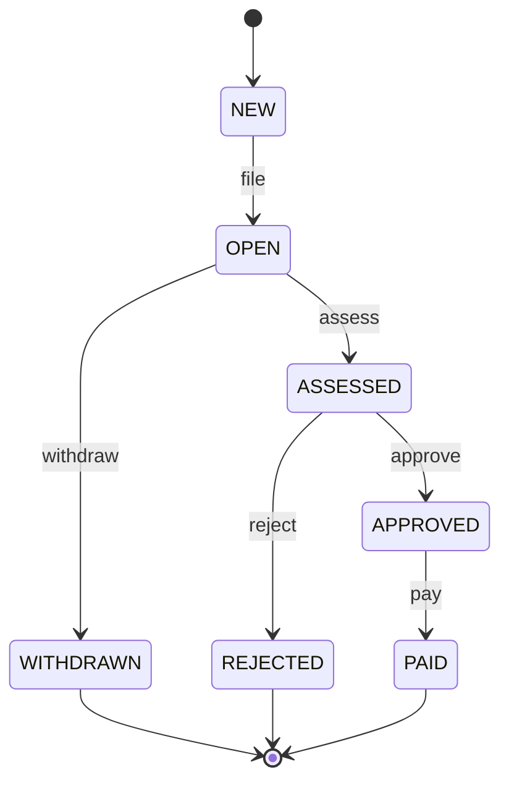
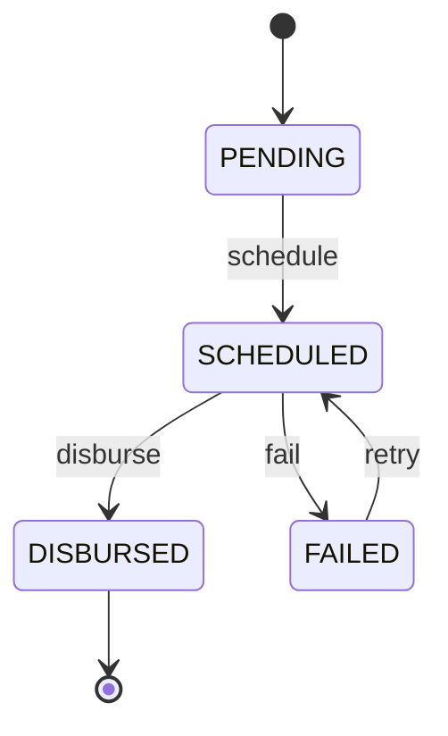
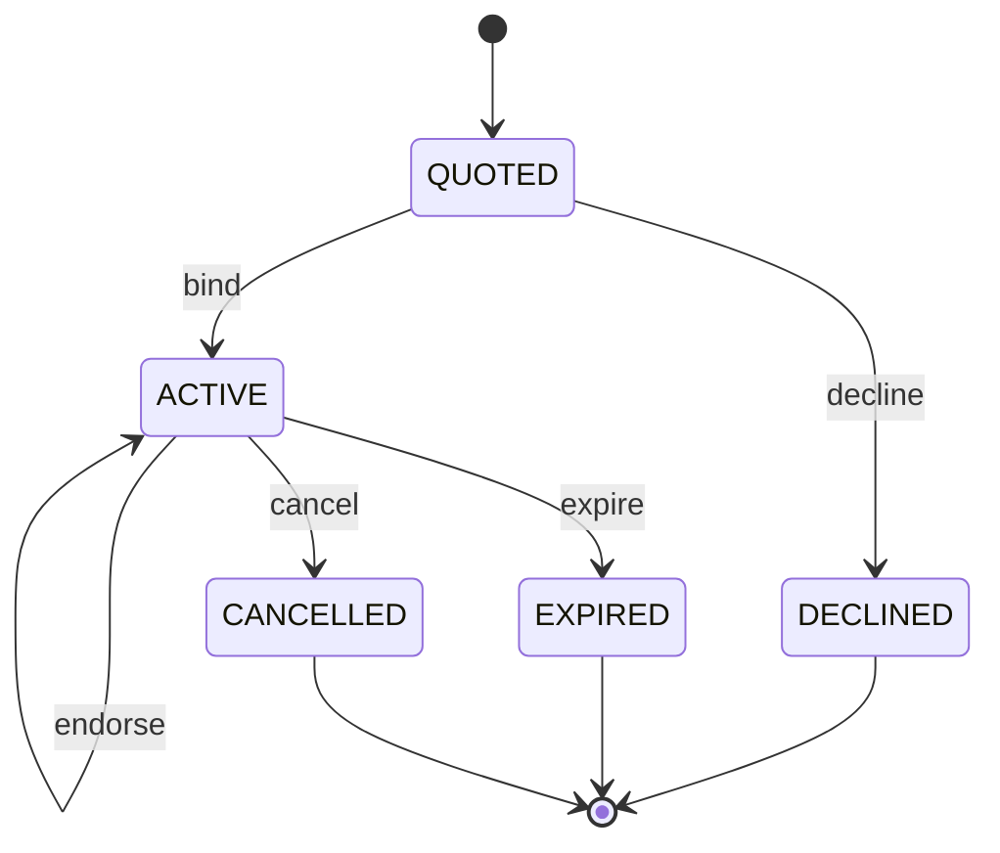

<!-- GENERATED by ./generate-concert-ecosystem -- do not edit: regenerated on every run. -->
# insurance ecosystem

Generated from the Pure models in `4` file(s) (`claim.pure`, `common.pure`, `payout.pure`, `policy.pure`), whose state machines are declared with the `concert::sm` profile. Java package `io.concert.eco.insurance`.

| smType | root class | states | terminal | events | analytics table |
|---|---|---|---|---|---|
| `claim` | `insurance::Claim` | 7 | WITHDRAWN, REJECTED, PAID | file, assess, withdraw, approve, reject, pay | `claims` |
| `payout` | `insurance::Payout` | 4 | DISBURSED | schedule, disburse, fail, retry | `payouts` |
| `policy` | `insurance::Policy` | 5 | DECLINED, EXPIRED, CANCELLED | bind, decline, endorse, expire, cancel | `policies` |

## State machines

### claim (`insurance::Claim`)



| event | from → to | payload | lock keys (besides `claim:<key>`) |
|---|---|---|---|
| `file` | NEW → OPEN | `insurance::FileClaim` | `policy:{policyId}` |
| `assess` | OPEN → ASSESSED | `insurance::AssessClaim` |  |
| `withdraw` | OPEN → WITHDRAWN | `insurance::WithdrawClaim` |  |
| `approve` | ASSESSED → APPROVED | `insurance::ApproveClaim` | `policy:{policyId}` |
| `reject` | ASSESSED → REJECTED | `insurance::RejectClaim` |  |
| `pay` | APPROVED → PAID | `insurance::PayClaim` | `policy:{policyId}`, `payee:{payeeAccount}` |

Data: `insurance::Claim`, `claimId` = instance key, `status` = state. Happy path (`samples/flows/claim-happy-path.json`, key `CLAIM-1001`): NEW -file-> OPEN -assess-> ASSESSED -approve-> APPROVED -pay-> PAID.

### payout (`insurance::Payout`)



| event | from → to | payload | lock keys (besides `payout:<key>`) |
|---|---|---|---|
| `schedule` | PENDING → SCHEDULED | `insurance::SchedulePayout` | `claim:{claimId}` |
| `disburse` | SCHEDULED → DISBURSED | `insurance::DisbursePayout` | `claim:{claimId}` |
| `fail` | SCHEDULED → FAILED | `insurance::FailPayout` | `claim:{claimId}` |
| `retry` | FAILED → SCHEDULED | `insurance::SchedulePayout` | `claim:{claimId}` |

Data: `insurance::Payout`, `payoutId` = instance key, `status` = state. Happy path (`samples/flows/payout-happy-path.json`, key `PAYOUT-1001`): PENDING -schedule-> SCHEDULED -disburse-> DISBURSED.

### policy (`insurance::Policy`)



| event | from → to | payload | lock keys (besides `policy:<key>`) |
|---|---|---|---|
| `bind` | QUOTED → ACTIVE | `insurance::BindPolicy` |  |
| `decline` | QUOTED → DECLINED | `insurance::DeclineQuote` |  |
| `endorse` | ACTIVE → ACTIVE | `insurance::EndorsePolicy` |  |
| `expire` | ACTIVE → EXPIRED | `insurance::ExpirePolicy` |  |
| `cancel` | ACTIVE → CANCELLED | `insurance::CancelPolicy` |  |

Data: `insurance::Policy`, `policyId` = instance key, `status` = state. Happy path (`samples/flows/policy-happy-path.json`, key `POLICY-1001`): QUOTED -bind-> ACTIVE -expire-> EXPIRED.

## Files

| file | owner |
|---|---|
| `src/main/pure/*.pure` | copies of the models dir (regenerated); `src/main/pure/concert/concert.pure` is the built-in profile |
| `src/main/java/.../<Root>Spec.java` | regenerated: states, transitions, payload types, terminal states, lock templates |
| `src/main/java/.../<Root>Machine.java` | **yours**: generated once, never overwritten (`--force` backs it up first) |
| `src/main/java/.../InsuranceMachines.java`, `InsuranceModels.java`, `InsuranceWorkerMain.java`, `InsuranceEvents.java` | regenerated |
| `src/test/java/.../InsuranceGeneratedTest.java` | regenerated: samples bind to their classes; happy paths reach terminal states through your machines |
| `samples/<smType>/<event>.json`, `samples/flows/*.json` | regenerated unless you edited them (hashes in `ecosystem.json`) |
| `compose.yml`, `send`, `send-flow`, `build.gradle.kts`, `README.md`, `ecosystem.json` | regenerated (`extra.gradle.kts` is yours) |
| `infra/deephaven/app.d/ecosystems/insurance.py` | regenerated: Deephaven tables of this ecosystem |

## Deploy

```bash
./generate-concert-ecosystem <models-dir> --name insurance      # after editing the models
./deploy-concert-ecosystem insurance --store spanner             # or postgres | dynamo; --no-analytics
```

`deploy` builds, starts the stack with this module's `compose.yml` override (service `insurance-worker`, profile
`insurance`), re-provisions ClickHouse, restarts the DuckDB sink and Deephaven so the new roots appear, and prints
the links. The trace UI finds the machines through the `MachineCatalog` SPI (no edits needed).

## Send events

```bash
./showcases/insurance/send list
./showcases/insurance/send <smType> <event> <instanceKey> [payload.json]   # default payload: samples/<smType>/<event>.json
./showcases/insurance/send-flow showcases/insurance/samples/flows/<smType>-happy-path.json
./showcases/insurance/send-flow all
```

Example queries (DuckDB: trace UI → Analytics → DuckDB; ClickHouse: add `FINAL`):

```sql
SELECT sm_state, count(*) FROM claims GROUP BY sm_state;
SELECT sm_state, count(*) FROM payouts GROUP BY sm_state;
SELECT sm_state, count(*) FROM policies GROUP BY sm_state;
```
