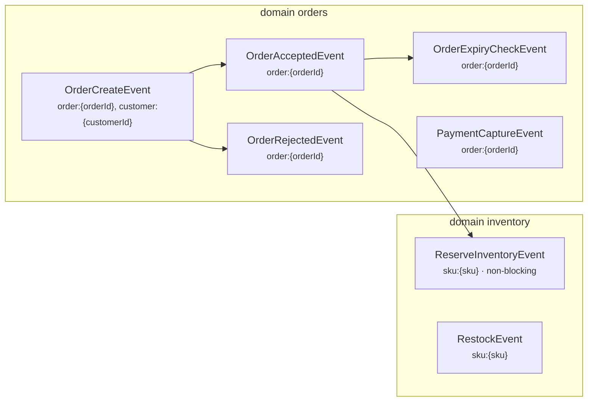

<!-- GENERATED by ./generate-concert-ecosystem -- do not edit: regenerated on every run. -->
# order-events ecosystem

Generated from the Pure models in `2` file(s) (`inventory.pure`, `orders.pure`), whose event types and keyed states are declared with the `concert::event` profile. Java package `io.concert.eco.order_events`.


## Event types

Every event goes `NEW → DONE` (or `SCHEDULED` first when sent with `--at`, `ERROR_BLOCKING` / `ERROR_NON_BLOCKING`
on failure); its handler (`<Event>Handler`, yours) runs with all of the event's lock keys held and may save keyed
state and emit follow-up events. Lifecycle rows go to the `evt_*` tables, state documents to `st_*`.



| event type | domain | lock keys | on error | attempts | emits | handler | analytics table |
|---|---|---|---|---|---|---|---|
| `ReserveInventoryEvent` | `inventory` | `sku:{sku}` | NON_BLOCKING | 3 | – | `ReserveInventoryHandler` | `evt_reserve_inventory_events` |
| `RestockEvent` | `inventory` | `sku:{sku}` | BLOCKING | 3 | – | `RestockHandler` | `evt_restock_events` |
| `OrderCreateEvent` | `orders` | `order:{orderId}`, `customer:{customerId}` | BLOCKING | 3 | OrderAcceptedEvent, OrderRejectedEvent | `OrderCreateHandler` | `evt_order_create_events` |
| `OrderAcceptedEvent` | `orders` | `order:{orderId}` | BLOCKING | 3 | ReserveInventoryEvent, OrderExpiryCheckEvent | `OrderAcceptedHandler` | `evt_order_accepted_events` |
| `OrderRejectedEvent` | `orders` | `order:{orderId}` | BLOCKING | 3 | – | `OrderRejectedHandler` | `evt_order_rejected_events` |
| `OrderExpiryCheckEvent` | `orders` | `order:{orderId}` | BLOCKING | 2 | – | `OrderExpiryCheckHandler` | `evt_order_expiry_check_events` |
| `PaymentCaptureEvent` | `orders` | `order:{orderId}` | BLOCKING | 3 | – | `PaymentCaptureHandler` | `evt_payment_capture_events` |

| keyed state | class | key | analytics table |
|---|---|---|---|
| `Stock` | `inventory::Stock` | `sku:{sku}` | `st_stocks` |
| `Order` | `orders::Order` | `order:{orderId}` | `st_orders` |

Flows (`samples/event-flows/`, from `concert::event.emits`):

- `RestockEvent-flow.json`: RestockEvent
- `OrderCreateEvent-flow.json`: OrderCreateEvent -> (OrderAcceptedEvent -> (ReserveInventoryEvent | OrderExpiryCheckEvent) | OrderRejectedEvent)
- `PaymentCaptureEvent-flow.json`: PaymentCaptureEvent

## Files

| file | owner |
|---|---|
| `src/main/pure/*.pure` | copies of the models dir (regenerated); `src/main/pure/concert/concert.pure` is the built-in profile |
| `src/main/java/.../<Domain>EventCatalog.java` | regenerated: event types (domain, lock templates, onError, attempts, emits) and keyed states, `EventCatalog` SPI |
| `src/main/java/.../<Event>Handler.java` | **yours**: generated once, never overwritten (`--force` backs it up first) |
| `src/main/java/.../OrderEventsEventTypes.java`, `OrderEventsEventWorkerMain.java` | regenerated: catalogs, handlers per domain, diagrams; the event worker |
| `src/test/java/.../OrderEventsEventFlowsTest.java` | regenerated: event samples bind; every event flow settles through your handlers on the real lock chain |
| `samples/events/<EventType>.json`, `samples/event-flows/*.json` | regenerated unless you edited them; add your own flows (optional `"expect"`) |
| `src/main/java/.../OrderEventsModels.java`, `OrderEventsEvents.java` | regenerated: POJOs; the Kinesis sender |
| `compose.yml`, `send`, `send-flow`, `build.gradle.kts`, `README.md`, `ecosystem.json` | regenerated (`extra.gradle.kts` is yours) |
| `infra/deephaven/app.d/ecosystems/order-events.py` | regenerated: Deephaven tables of this ecosystem |

## Deploy

```bash
./generate-concert-ecosystem <models-dir> --name order-events      # after editing the models
./deploy-concert-ecosystem order-events --store spanner             # or postgres | dynamo; --no-analytics
```

`deploy` builds, starts the stack with this module's `compose.yml` override (service `order-events-event-worker`, profile
`order-events`), re-provisions ClickHouse, restarts the DuckDB sink and Deephaven so the new roots appear, and prints
the links. The trace UI finds the machines and event catalogs through their SPIs (no edits needed).

## Send events

```bash
./showcases/order-events/send list
./showcases/order-events/send <EventType> [payload.json] [--at +5m|ISO]     # default payload: samples/events/<EventType>.json
./showcases/order-events/send-flow showcases/order-events/samples/event-flows/<EventType>-flow.json
scripts/events.sh list errors        # ERROR_BLOCKING / ERROR_NON_BLOCKING; retry | skip <eventId>
./showcases/order-events/send-flow all
```

Example queries (DuckDB: trace UI → Analytics → DuckDB; ClickHouse: add `FINAL`):

```sql
SELECT status, count(*), avg(attempts) FROM evt_reserve_inventory_events GROUP BY status;
SELECT status, count(*), avg(attempts) FROM evt_restock_events GROUP BY status;
SELECT status, count(*), avg(attempts) FROM evt_order_create_events GROUP BY status;
SELECT status, count(*), avg(attempts) FROM evt_order_accepted_events GROUP BY status;
SELECT status, count(*), avg(attempts) FROM evt_order_rejected_events GROUP BY status;
SELECT status, count(*), avg(attempts) FROM evt_order_expiry_check_events GROUP BY status;
SELECT status, count(*), avg(attempts) FROM evt_payment_capture_events GROUP BY status;
SELECT event_id, status, error, attempts, parent_event_id FROM evt_reserve_inventory_events WHERE status LIKE 'ERROR_%';
SELECT * FROM st_stocks ORDER BY completed_at DESC LIMIT 10;
SELECT * FROM st_orders ORDER BY completed_at DESC LIMIT 10;
```
