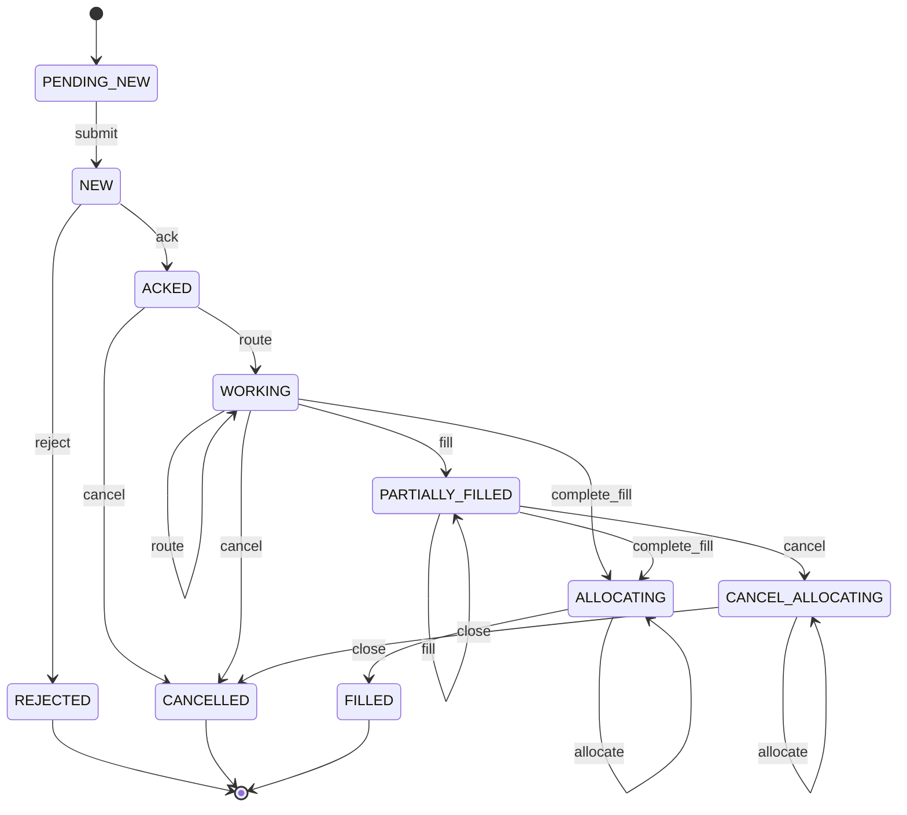
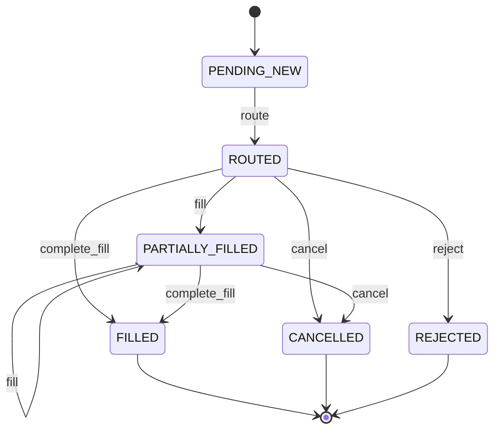
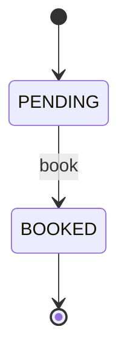
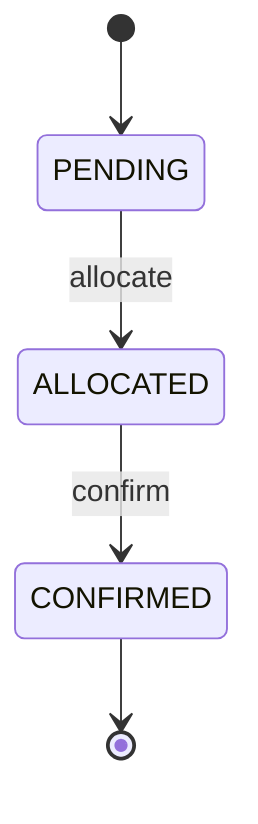

<!-- GENERATED by ./generate-concert-ecosystem -- do not edit: regenerated on every run. -->
# trading-gen ecosystem

Generated from the Pure models in `5` file(s) (`commands.pure`, `common.pure`, `marketdata.pure`, `order.pure`, `refdata.pure`), whose state machines are declared with the `concert::sm` profile. Java package `io.concert.eco.trading_gen`.

| smType | root class | states | terminal | events | analytics table |
|---|---|---|---|---|---|
| `gen_trading_order` | `trading::order::Order` | 10 | REJECTED, CANCELLED, FILLED | submit, ack, reject, route, cancel, fill, complete_fill, allocate, close | `gen_trading_orders` |
| `gen_trading_execution` | `trading::order::Execution` | 6 | FILLED, CANCELLED, REJECTED | route, fill, complete_fill, cancel, reject | `gen_trading_executions` |
| `gen_trading_fill` | `trading::order::Fill` | 2 | BOOKED | book | `gen_trading_fills` |
| `gen_trading_allocation` | `trading::order::Allocation` | 3 | CONFIRMED | allocate, confirm | `gen_trading_allocations` |

## State machines

### gen_trading_order (`trading::order::Order`)



| event | from → to | payload | lock keys (besides `gen_trading_order:<key>`) |
|---|---|---|---|
| `submit` | PENDING_NEW → NEW | `trading::command::NewOrderCommand` | `account:{accountId}` |
| `ack` | NEW → ACKED | `trading::command::AckCommand` | `account:{accountId}` |
| `reject` | NEW → REJECTED | `trading::command::RejectCommand` | `account:{accountId}` |
| `route` | ACKED → WORKING | `trading::command::RouteCommand` | `account:{accountId}` |
| `cancel` | ACKED → CANCELLED | `trading::command::CancelCommand` | `account:{accountId}` |
| `route` | WORKING → WORKING | `trading::command::RouteCommand` | `account:{accountId}` |
| `fill` | WORKING → PARTIALLY_FILLED | `trading::command::FillCommand` | `account:{accountId}` |
| `complete_fill` | WORKING → ALLOCATING | `trading::command::FillCommand` | `account:{accountId}` |
| `cancel` | WORKING → CANCELLED | `trading::command::CancelCommand` | `account:{accountId}` |
| `route` | PARTIALLY_FILLED → PARTIALLY_FILLED | `trading::command::RouteCommand` | `account:{accountId}` |
| `fill` | PARTIALLY_FILLED → PARTIALLY_FILLED | `trading::command::FillCommand` | `account:{accountId}` |
| `complete_fill` | PARTIALLY_FILLED → ALLOCATING | `trading::command::FillCommand` | `account:{accountId}` |
| `cancel` | PARTIALLY_FILLED → CANCEL_ALLOCATING | `trading::command::CancelCommand` | `account:{accountId}` |
| `allocate` | ALLOCATING → ALLOCATING | `trading::command::AllocateCommand` | `account:{accountId}` |
| `close` | ALLOCATING → FILLED | `trading::command::CloseOrderCommand` | `account:{accountId}` |
| `allocate` | CANCEL_ALLOCATING → CANCEL_ALLOCATING | `trading::command::AllocateCommand` | `account:{accountId}` |
| `close` | CANCEL_ALLOCATING → CANCELLED | `trading::command::CloseOrderCommand` | `account:{accountId}` |

Data: `trading::order::Order`, `orderId` = instance key, `status` = state. Happy path (`samples/flows/gen_trading_order-happy-path.json`, key `GEN-TRADING-ORDER-1001`): PENDING_NEW -submit-> NEW -ack-> ACKED -route-> WORKING -complete_fill-> ALLOCATING -close-> FILLED.

### gen_trading_execution (`trading::order::Execution`)



| event | from → to | payload | lock keys (besides `gen_trading_execution:<key>`) |
|---|---|---|---|
| `route` | PENDING_NEW → ROUTED | `trading::command::RouteCommand` | `gen_trading_order:{orderId}` |
| `fill` | ROUTED → PARTIALLY_FILLED | `trading::command::FillCommand` | `gen_trading_order:{orderId}` |
| `complete_fill` | ROUTED → FILLED | `trading::command::FillCommand` | `gen_trading_order:{orderId}` |
| `cancel` | ROUTED → CANCELLED | `trading::command::CancelCommand` | `gen_trading_order:{orderId}` |
| `reject` | ROUTED → REJECTED | `trading::command::RejectCommand` | `gen_trading_order:{orderId}` |
| `fill` | PARTIALLY_FILLED → PARTIALLY_FILLED | `trading::command::FillCommand` | `gen_trading_order:{orderId}` |
| `complete_fill` | PARTIALLY_FILLED → FILLED | `trading::command::FillCommand` | `gen_trading_order:{orderId}` |
| `cancel` | PARTIALLY_FILLED → CANCELLED | `trading::command::CancelCommand` | `gen_trading_order:{orderId}` |

Data: `trading::order::Execution`, `execId` = instance key, `status` = state. Happy path (`samples/flows/gen_trading_execution-happy-path.json`, key `GEN-TRADING-EXECUTION-1001`): PENDING_NEW -route-> ROUTED -complete_fill-> FILLED.

### gen_trading_fill (`trading::order::Fill`)



| event | from → to | payload | lock keys (besides `gen_trading_fill:<key>`) |
|---|---|---|---|
| `book` | PENDING → BOOKED | `trading::command::FillCommand` | `gen_trading_order:{orderId}`, `gen_trading_execution:{execId}` |

Data: `trading::order::Fill`, `fillId` = instance key, `status` = state. Happy path (`samples/flows/gen_trading_fill-happy-path.json`, key `GEN-TRADING-FILL-1001`): PENDING -book-> BOOKED.

### gen_trading_allocation (`trading::order::Allocation`)



| event | from → to | payload | lock keys (besides `gen_trading_allocation:<key>`) |
|---|---|---|---|
| `allocate` | PENDING → ALLOCATED | `trading::command::AllocateCommand` | `gen_trading_order:{orderId}`, `account:{allocAccountId}` |
| `confirm` | ALLOCATED → CONFIRMED | `trading::command::ConfirmAllocationCommand` | `gen_trading_order:{orderId}`, `account:{allocAccountId}` |

Data: `trading::order::Allocation`, `allocId` = instance key, `status` = state. Happy path (`samples/flows/gen_trading_allocation-happy-path.json`, key `GEN-TRADING-ALLOCATION-1001`): PENDING -allocate-> ALLOCATED -confirm-> CONFIRMED.

## Files

| file | owner |
|---|---|
| `src/main/pure/*.pure` | copies of the models dir (regenerated); `src/main/pure/concert/concert.pure` is the built-in profile |
| `src/main/java/.../<Root>Spec.java` | regenerated: states, transitions, payload types, terminal states, lock templates |
| `src/main/java/.../<Root>Machine.java` | **yours**: generated once, never overwritten (`--force` backs it up first) |
| `src/main/java/.../TradingGenMachines.java`, `TradingGenWorkerMain.java` | regenerated |
| `src/test/java/.../TradingGenGeneratedTest.java` | regenerated: samples bind to their classes; happy paths reach terminal states through your machines |
| `src/main/java/.../TradingGenModels.java`, `TradingGenEvents.java` | regenerated: POJOs; the Kinesis sender |
| `samples/<smType>/<event>.json`, `samples/flows/*.json` | regenerated unless you edited them (hashes in `ecosystem.json`) |
| `compose.yml`, `send`, `send-flow`, `build.gradle.kts`, `README.md`, `ecosystem.json` | regenerated (`extra.gradle.kts` is yours) |
| `infra/deephaven/app.d/ecosystems/trading-gen.py` | regenerated: Deephaven tables of this ecosystem |

## Deploy

```bash
./generate-concert-ecosystem <models-dir> --name trading-gen      # after editing the models
./deploy-concert-ecosystem trading-gen --store spanner             # or postgres | dynamo; --no-analytics
```

`deploy` builds, starts the stack with this module's `compose.yml` override (service `trading-gen-worker`, profile
`trading-gen`), re-provisions ClickHouse, restarts the DuckDB sink and Deephaven so the new roots appear, and prints
the links. The trace UI finds the machines and event catalogs through their SPIs (no edits needed).

## Send events

```bash
./showcases/trading-gen/send list
./showcases/trading-gen/send <smType> <event> <instanceKey> [payload.json]   # default payload: samples/<smType>/<event>.json
./showcases/trading-gen/send-flow showcases/trading-gen/samples/flows/<smType>-happy-path.json
./showcases/trading-gen/send-flow all
```

Example queries (DuckDB: trace UI → Analytics → DuckDB; ClickHouse: add `FINAL`):

```sql
SELECT sm_state, count(*) FROM gen_trading_orders GROUP BY sm_state;
SELECT sm_state, count(*) FROM gen_trading_executions GROUP BY sm_state;
SELECT sm_state, count(*) FROM gen_trading_fills GROUP BY sm_state;
SELECT sm_state, count(*) FROM gen_trading_allocations GROUP BY sm_state;
```
