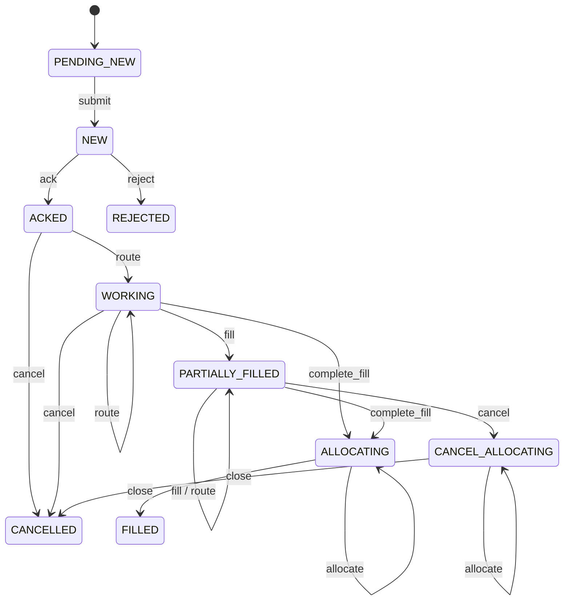

# trading showcase

Equities order flow through concert, joined in the analytics stores with market data that bypasses
concert entirely.

```
                     ┌──────────────── concert (Kinesis → locks → Temporal entity workflows) ────────────────┐
TradingLoadGen ────▶ │ trading_order / trading_execution / trading_fill / trading_allocation state machines   │
 (orders, fills)     └───────────────────────── terminal state → entity-snapshots (Kafka) ───────────────────┘
                                                                     │
marketdata-sim ────▶ ref.instruments, ref.accounts, ref.venues,      ▼
 (no concert)        md.ticks, md.bars.1m (Kafka)  ──────────▶  ClickHouse · Deephaven · DuckDB
```

Both generators evaluate the same deterministic price model (`io.concert.marketdata.PriceModel`): the
quote for a symbol at an instant is a pure function of `(seed, volMultiplier, symbol, time)`. With the
same `--seed`/`--vol-mult`, every fill is priced at the bid or ask that `md.ticks` shows at the fill's
timestamp, so slippage and TCA queries line up exactly. The order flow itself (which orders, sides,
sizes, venues, fills, cancels, allocations) is seeded with the seed mixed with the run id
(`TradingFlowGenerator.flowSeed`), so each `scripts/trading-load.sh` run (new run id) sends different
orders against the same prices; `--run-id <id>` with the same seed replays a run.

## Phase A (`trading-model`, this module and `marketdata-sim`)

**The Pure files are the only model code.** `core/trading-model/src/main/pure/*.pure` defines every type:
reference data, market data, the order aggregates and the commands. `trading-model` generates their
Java classes (`trading::x::Y` → `io.concert.trading.x.Y`), and every consumer codes against those:
the generator and phase B state machines (`trading`), the simulator (`marketdata-sim`), and the
analytics sinks (DDL from `model-pure`'s `ResolvedModel`, rows from the generated classes). There
are no hand-written model records anywhere, and all JSON is `ModelJson` output.

| module | depends on | contents |
|---|---|---|
| `trading-model` | model-runtime (+ model-codegen processor) | `common`, `refdata`, `marketdata`, `order`, `commands` `.pure`; `TradingModels` (`@LegendModel`) |
| `marketdata-sim` | trading-model, kafka-clients | universe, price model, tick/bar generation, Kafka publisher |
| `trading` | trading-model, marketdata-sim, orchestration, worker-sdk | `TradingFlows`, generator, Kinesis publisher; typed state machines + `TradingWorkerMain` (phase B part 1) |

| piece | where |
|---|---|
| Pure models | `core/trading-model/src/main/pure/{common,refdata,marketdata,order,commands}.pure` |
| generated classes | `io.concert.trading.model.TradingModels`: e.g. `io.concert.trading.command.FillCommand`, `io.concert.trading.order.Order`, `io.concert.trading.refdata.Instrument`, `io.concert.trading.marketdata.Tick` |
| state machines as data | `TradingFlows` — states, transitions + payload class, terminals, lock keys, Mermaid |
| event builder | `TradingEvents.envelope(smType, eventType, id, command, ts)` — payload = generated command written with `ModelJson`; key and lock keys rendered from it per `TradingFlows` |
| generator | `TradingFlowGenerator` (pure, iterator of `EventEnvelope`) + `TradingLoadGen` (Kinesis publisher) |
| market data | `marketdata-sim`: `MarketUniverse` (52 symbols, 20 accounts, 8 venues, as generated `Instrument`/`Account`/`Venue`), `PriceModel` (generated `Quote`), `TickGenerator` (`Tick`), `BarAggregator` (`Bar`), `MarketDataSimMain` |

```bash
./gradlew :trading:run --args="--dry-run --orders 3"              # print events, no Kinesis
./gradlew :trading:run --args="--orders 500 --rate 100"           # → Kinesis concert-events (KINESIS_ENDPOINT for LocalStack)
./gradlew :marketdata-sim:run --args="--dry-run"                  # print ref data, ticks, bars on a virtual clock
KAFKA_BOOTSTRAP=localhost:9092 ./gradlew :marketdata-sim:run --args="--tick-rate 200"
```

### Lifecycle

See the Javadoc of `TradingFlows` for the ASCII diagram and the reasoning. In short: one venue fill is
one `FillCommand` sent as three events — `book` creates a `trading_fill` that is terminal at once
(`BOOKED`, so it reaches analytics immediately), and `fill`/`complete_fill` update the execution and the
order. An order becomes terminal (`FILLED` / `CANCELLED`) only on `close`, after its allocations;
`REJECTED` and cancel-before-any-fill are terminal directly.



### Lock keys

The platform keeps per-shard order on each event's **first sorted** lock key, so every event of one
entity has the same first key (`TradingFlowsTest.allEventsOfAnEntityShareTheirFirstSortedKey`), and
the generator uses it as the Kinesis partition key.

| target | events | extra lock keys | first sorted key |
|---|---|---|---|
| `trading_order:<orderId>` | submit, ack, reject, route, fill, complete_fill, cancel, allocate, close | `account:<accountId>` (credit check / usage) | `account:` |
| `trading_execution:<execId>` | route, fill, complete_fill, cancel, reject | `trading_order:<orderId>` | `trading_execution:` |
| `trading_fill:<fillId>` | book | `trading_order:<orderId>`, `trading_execution:<execId>` | `trading_execution:` |
| `trading_allocation:<allocId>` | allocate, confirm | `trading_order:<orderId>`, `account:<allocAccountId>` | `account:` |

### Kafka formats (`marketdata-sim`)

Values are the generated `Instrument`, `Account`, `Venue`, `Tick` and `Bar` classes written with `ModelJson`.

| topic | key | policy | value |
|---|---|---|---|
| `ref.instruments` | symbol | compact, 1 partition | `{symbol, isin, name, assetClass, sector, currency, lotSize, tickSize, refPrice, primaryMic, updatedAt}` |
| `ref.accounts` | accountId | compact, 1 partition | `{accountId, name, desk, type, baseCurrency, creditLimit, updatedAt}` |
| `ref.venues` | mic | compact, 1 partition | `{mic, name, type, makerFeePerShare, takerFeePerShare, updatedAt}` |
| `md.ticks` | symbol | delete, 1 h (`segment.ms` 10 min), 6 partitions | `{symbol, ts, tsMillis, seq, bid, bidSize, ask, askSize, mid, last, lastSize, volume, tradeVenue}` |
| `md.bars.1m` | symbol | delete, 24 h, 3 partitions | `{symbol, start, end, open, high, low, close, volume, vwap, trades, ticks}` |

* **Decimals are JSON numbers** in plain notation (`230.15`): ClickHouse reads them into `Decimal`
  columns directly, Deephaven reads them as `double` without parsing strings. At most 6 decimals.
* **Timestamps are ISO-8601 UTC strings** (`2026-10-05T14:30:00.125Z`); ticks also carry `tsMillis`.
* Properties are sorted by name, and an absent optional property is **omitted**, not `null` (e.g.
  `tradeVenue` on a quote-only tick, `vwap` on a quiet bar). ClickHouse fills omitted fields with the
  column default (`input_format_defaults_for_omitted_fields`, on by default), so `Nullable` columns
  get `NULL`. Deephaven's JSON spec does the same.
* `lastSize = 0` marks a quote-only tick (`last` repeats the previous trade), so `sum(lastSize)` is volume.

Sample tick:
```json
{"ask":406.12,"askSize":1000,"bid":406.08,"bidSize":1800,"last":406.12,"lastSize":700,"mid":406.10,"seq":1,
 "symbol":"CAT","tradeVenue":"MEMX","ts":"2026-10-05T14:30:00Z","tsMillis":1791210600000,"volume":700}
```

## Phase B, part 1: typed state machines (implemented)

| piece | where |
|---|---|
| spec adapter | `machines.TradingSpecs.spec(flow)` — the SDK `StateMachineSpec` built from `TradingFlows` (states, transitions, terminals); payload class names resolve to the generated `io.concert.trading.command.*` classes |
| machines | `machines.TradingOrderMachine` (`trading_order`, data `Order`), `TradingExecutionMachine` (`trading_execution`, `Execution`), `TradingFillMachine` (`trading_fill`, `Fill`), `TradingAllocationMachine` (`trading_allocation`, `Allocation`), all `ModelStateMachine<D>` via `TradingStateMachine` |
| registry | `machines.TradingMachines` — smType → impl, spec, model Mermaid; `registerSpecs()` for the trace UI |
| worker | `TradingWorkerMain` — workers for all four smTypes in one process (`bin/trading-worker`, `./gradlew :trading:runWorker`) |
| tests | `TradingMachinesTest` (Temporal test server, in-memory store, capturing snapshot publisher), `TradingSpecsTest` |

The `@LegendModel` on each machine names the `trading-model` file set (same `files`, `javaPackage =
"io.concert"`, own `root`). Classes are generated only in `trading-model`; `trading` runs no
annotation processor, so the annotation is runtime metadata (model and aggregate root).

**Data shape: aggregates only.** Every entity is its own workflow and never reads another entity's
data. The order keeps quantities, prices, fees and timestamps; the generated association lists
(`Order.executions`, `Order.allocations`, `Execution.fills`) stay empty (`[]` in the JSON). Executions,
fills and allocations reach analytics as their own terminal snapshots and join to the order on
`orderId` / `execId`. So an order snapshot does **not** carry its execution → fill tree (that changes
the earlier design below).

Rules (a violating event is rejected, `TransitionResult.accepted = false`; state, data and version
stay unchanged):

| machine | event | handling / rule |
|---|---|---|
| order | `submit` | copies `NewOrderCommand` (`leavesQty = quantity`, `arrivalPx`, `createdAt = ts`); quantity > 0, `LIMIT` needs a limit price |
| | `ack` / `reject` | `ackedAt` / `rejectReason`, `completedAt` |
| | `route` | `routedQty += qty`; reject if `routedQty > quantity` |
| | `fill` / `complete_fill` | `filledQty`, `leavesQty`, `notional += px·qty`, `avgPx = notional / filledQty` (6 dp, half-even), `totalFees`, `firstFillAt` / `lastFillAt`. Reject an overfill (`filledQty > quantity`), a fill beyond `routedQty`, a `complete_fill` that does not fill exactly, a `fill` that does (must be `complete_fill`), and on `LIMIT` orders a BUY above / SELL or SELL_SHORT below the limit |
| | `cancel` | `cancelReason`, `leavesQty = 0`, `completedAt` when it goes straight to `CANCELLED` |
| | `allocate` | `allocatedQty += qty`; reject if `allocatedQty > filledQty` |
| | `close` | only when `allocatedQty == filledQty` (and the command's `allocatedQty` agrees); `completedAt` |
| execution | `route`, `fill`/`complete_fill`, `cancel`, `reject` | same quantity rules against the child quantity; limit check against the routed limit price; `avgPx` updated incrementally (within 1e-6) |
| fill | `book` | copies the `FillCommand`, `BOOKED` |
| allocation | `allocate`, `confirm` | copies the `AllocateCommand` (`accountId = allocAccountId`); `confirm` must name the same account |

Every event must also name the entity's `orderId` (and the order's `accountId`, symbol and side where
present). All timestamps are event time, the payload's `ts`, else `Workflow.currentTimeMillis()`.

### Running it locally

```bash
# workers for trading_order, trading_execution, trading_fill, trading_allocation (no SM_TYPE needed;
# TRADING_SM_TYPES=a,b restricts them). Same env as the sample worker:
TEMPORAL_ADDRESS=localhost:7233 STORE_KIND=postgres STORE_JDBC_URL=jdbc:postgresql://localhost:5432/concert \
  KAFKA_BOOTSTRAP=localhost:9092 ./gradlew :trading:runWorker

# order flow into the running stack (LocalStack Kinesis → coordinator → the workers above)
KINESIS_ENDPOINT=http://localhost:4566 AWS_REGION=us-east-1 ./gradlew :trading:run --args="--orders 200 --rate 50"
```

`./gradlew :trading:installDist` builds both `bin/trading` (load generator) and `bin/trading-worker`.

### Compose / Dockerfile (applied: `trading-worker` in profile `trading`, `trading-loadgen` in `trading-load`; see the root README "Trading showcase")

```dockerfile
# build stage: add :trading:installDist to the installDist list, then
FROM runtime AS trading-worker
COPY --from=build /src/showcases/trading/build/install/trading /app
ENTRYPOINT ["/app/bin/trading-worker"]
```

```yaml
  trading-worker:
    profiles: [apps]
    build: { context: ., target: trading-worker }
    image: concert-temporal/trading-worker
    depends_on:
      <<: *app-deps
      coordinator: { condition: service_started }
    environment:
      <<: *app-env                       # STORE_KIND, TEMPORAL_ADDRESS, KAFKA_BOOTSTRAP, ...
      STORE_INIT_SCHEMA: "false"
      JAVA_OPTS: "-XX:+UseZGC -XX:MaxRAMPercentage=75"
    restart: unless-stopped
```

The trace UI draws the trading diagrams once it calls `TradingMachines.registerSpecs()` next to
`SampleMachines.registerSpecs()` (needs `implementation(project(":trading"))` in `trace-ui`).

---

## Phase B design (not implemented)

### 1. State machines

**Implemented in part 1, see above** (with one change: the order keeps aggregates only, no embedded
execution/fill tree). The original notes:

One `ModelStateMachine<D>` per flow over the generated `io.concert.trading.order.*` classes from
`trading-model`, with `root = "trading::order::<Order|Execution|Fill|Allocation>"`. The machines live in
`trading` and only reference the generated classes. They may carry `@LegendModel` (same `files` and
`javaPackage` as `TradingModels`) for runtime discovery, e.g. the trace UI's model view: `trading` does
not run the annotation processor, so nothing is generated twice, spec built from `TradingFlows`
(`payloadClass` → generated command class). Handlers only maintain their own aggregate:

* order: `submit` copies the command (`leavesQty = quantity`, `arrivalPx`, `createdAt`); `route` adds an
  `Execution` row and `routedQty`; `fill`/`complete_fill` add the fill under its execution, update
  `filledQty`, `leavesQty`, `avgPx`, `notional`, `totalFees`; `allocate` adds an `Allocation`; `close`
  checks `allocatedQty == filledQty`, sets `completedAt`. Reject a fill that would overfill.
* execution / fill / allocation: same shape, smaller.
* Credit (account lock): phase B can keep a per-account exposure row in the store keyed `account:<id>`,
  updated in `submit`/`fill`/`cancel`; that is why those events hold the lock.

Terminal states publish `{entityId, smType, state, version, createdAt, completedAt, model}` to
`entity-snapshots` (Step 6). Fill snapshots arrive within one event of the fill; order snapshots arrive
when the order closes, carrying the full execution → fill tree and the allocations.

### 2. ClickHouse

The DDL below is what a generator should emit from the Pure models (`ResolvedModel` → columns:
`Decimal` → `Decimal(18, 6)`, `Integer` → `Int64`, `DateTime` → `DateTime64(3, 'UTC')`, enums →
`LowCardinality(String)`, `[0..1]` → `Nullable`). It is written out here to show the shape, not
meant to be maintained by hand.

Database `trading`. Every Kafka source follows the same pattern: a `Kafka` engine table (strings for
timestamps, parsed in the MV so the format setting does not matter), a materialized view, a
MergeTree-family target.

```sql
CREATE DATABASE IF NOT EXISTS trading;

-- ---------- reference data: ReplacingMergeTree keeps the latest version per id ----------
CREATE TABLE trading.instruments_kafka (
    symbol String, isin String, name String, assetClass String, sector String, currency String,
    lotSize UInt32, tickSize Decimal(18, 6), refPrice Decimal(18, 6), primaryMic String, updatedAt String
) ENGINE = Kafka SETTINGS kafka_broker_list = 'kafka:9092', kafka_topic_list = 'ref.instruments',
    kafka_group_name = 'ch-ref-instruments', kafka_format = 'JSONEachRow';

CREATE TABLE trading.instruments (
    symbol LowCardinality(String), isin String, name String, asset_class LowCardinality(String),
    sector LowCardinality(String), currency LowCardinality(String), lot_size UInt32,
    tick_size Decimal(18, 6), ref_price Decimal(18, 6), primary_mic LowCardinality(String),
    updated_at DateTime64(3, 'UTC')
) ENGINE = ReplacingMergeTree(updated_at) ORDER BY symbol;

CREATE MATERIALIZED VIEW trading.instruments_mv TO trading.instruments AS
SELECT symbol, isin, name, assetClass AS asset_class, sector, currency, lotSize AS lot_size,
       tickSize AS tick_size, refPrice AS ref_price, primaryMic AS primary_mic,
       parseDateTime64BestEffort(updatedAt, 3, 'UTC') AS updated_at
FROM trading.instruments_kafka;

-- ref.accounts and ref.venues: identical pattern
--   trading.accounts (account_id, name, desk, type, base_currency, credit_limit Decimal(18,2), updated_at) ORDER BY account_id
--   trading.venues   (mic, name, type, maker_fee_per_share Decimal(18,6), taker_fee_per_share Decimal(18,6), updated_at) ORDER BY mic

-- ---------- ticks: plain MergeTree, time-partitioned, TTL ----------
CREATE TABLE trading.ticks_kafka (
    symbol String, ts String, tsMillis Int64, seq UInt64,
    bid Decimal(18, 6), bidSize UInt32, ask Decimal(18, 6), askSize UInt32, mid Decimal(18, 6),
    last Decimal(18, 6), lastSize UInt32, volume UInt64, tradeVenue Nullable(String)
) ENGINE = Kafka SETTINGS kafka_broker_list = 'kafka:9092', kafka_topic_list = 'md.ticks',
    kafka_group_name = 'ch-md-ticks', kafka_format = 'JSONEachRow', kafka_num_consumers = 2;

CREATE TABLE trading.ticks (
    symbol LowCardinality(String), ts DateTime64(3, 'UTC'), seq UInt64,
    bid Decimal(18, 6), bid_size UInt32, ask Decimal(18, 6), ask_size UInt32, mid Decimal(18, 6),
    last Decimal(18, 6), last_size UInt32, volume UInt64, trade_venue LowCardinality(Nullable(String))
) ENGINE = MergeTree PARTITION BY toDate(ts) ORDER BY (symbol, ts)
  TTL toDateTime(ts) + INTERVAL 7 DAY;

CREATE MATERIALIZED VIEW trading.ticks_mv TO trading.ticks AS
SELECT symbol, fromUnixTimestamp64Milli(tsMillis, 'UTC') AS ts, seq, bid, bidSize AS bid_size,
       ask, askSize AS ask_size, mid, last, lastSize AS last_size, volume, tradeVenue AS trade_venue
FROM trading.ticks_kafka;

-- md.bars.1m (optional): trading.bars_1m MergeTree ORDER BY (symbol, start)

-- ---------- order-flow snapshots from entity-snapshots ----------
-- If the Step 6 sink-clickhouse provisioner already generates per-smType tables from the Pure models,
-- use those (same columns); this is the hand-written equivalent for the three tables queried below.
CREATE TABLE trading.snapshots_kafka (
    entityId String, smType String, state String, version UInt64,
    createdAt Nullable(String), completedAt Nullable(String), model String   -- nested JSON kept as text
) ENGINE = Kafka SETTINGS kafka_broker_list = 'kafka:9092', kafka_topic_list = 'entity-snapshots',
    kafka_group_name = 'ch-trading-snapshots', kafka_format = 'JSONEachRow',
    input_format_json_read_objects_as_strings = 1;

CREATE TABLE trading.fills (
    fill_id String, order_id String, exec_id String, account_id LowCardinality(String),
    symbol LowCardinality(String), side LowCardinality(String), quantity UInt32, price Decimal(18, 6),
    venue LowCardinality(String), liquidity LowCardinality(String), fee Decimal(18, 6),
    ts DateTime64(3, 'UTC'), version UInt64
) ENGINE = ReplacingMergeTree(version) ORDER BY (symbol, ts, fill_id);

CREATE MATERIALIZED VIEW trading.fills_mv TO trading.fills AS
SELECT JSONExtractString(model, 'fillId') AS fill_id, JSONExtractString(model, 'orderId') AS order_id,
       JSONExtractString(model, 'execId') AS exec_id, JSONExtractString(model, 'accountId') AS account_id,
       JSONExtractString(model, 'symbol') AS symbol, JSONExtractString(model, 'side') AS side,
       JSONExtractUInt(model, 'quantity') AS quantity,
       toDecimal64(JSONExtractRaw(model, 'price'), 6) AS price,
       JSONExtractString(model, 'venue') AS venue, JSONExtractString(model, 'liquidity') AS liquidity,
       toDecimal64(JSONExtractRaw(model, 'fee'), 6) AS fee,
       parseDateTime64BestEffort(JSONExtractString(model, 'ts'), 3, 'UTC') AS ts, version
FROM trading.snapshots_kafka WHERE smType = 'trading_fill';

-- trading.orders:      order_id, account_id, symbol, side, order_type, limit_price, quantity, filled_qty,
--                      avg_px, arrival_px, notional, total_fees, status, created_at, completed_at, version
--                      ReplacingMergeTree(version) ORDER BY order_id   (WHERE smType = 'trading_order')
-- trading.allocations: alloc_id, order_id, account_id, symbol, side, quantity, avg_px, status, confirmed_at, version
--                      ReplacingMergeTree(version) ORDER BY alloc_id   (WHERE smType = 'trading_allocation')
```

Example queries:

```sql
-- Traded notional by sector and side today (fills ⨝ instruments)
SELECT i.sector, f.side, count() AS fills, sum(f.quantity) AS shares,
       round(sum(f.quantity * f.price)) AS notional
FROM trading.fills AS f FINAL
INNER JOIN trading.instruments AS i FINAL ON i.symbol = f.symbol
WHERE f.ts >= today()
GROUP BY i.sector, f.side ORDER BY notional DESC;

-- Slippage vs the mid at fill time (ASOF JOIN fills ⨝ ticks), by venue and liquidity.
-- Positive = paid more than mid (buys) / received less (sells).
SELECT f.venue, f.liquidity, count() AS fills,
       round(avg((f.price - t.mid) / t.mid * 1e4 * if(f.side = 'BUY', 1, -1)), 2) AS slippage_bps,
       round(sum(f.fee), 2) AS fees
FROM trading.fills AS f FINAL
ASOF JOIN trading.ticks AS t ON t.symbol = f.symbol AND f.ts >= t.ts
GROUP BY f.venue, f.liquidity ORDER BY slippage_bps;

-- Per order: execution VWAP vs arrival price (implementation shortfall) and vs market VWAP over the
-- order's life (trades in md.ticks between created_at and completed_at).
WITH exec AS (
    SELECT order_id, sum(price * quantity) / sum(quantity) AS vwap, sum(quantity) AS filled
    FROM trading.fills FINAL GROUP BY order_id
)
SELECT o.order_id, o.symbol, o.side, o.quantity, e.filled, o.arrival_px, round(e.vwap, 4) AS exec_vwap,
       round((e.vwap - o.arrival_px) / o.arrival_px * 1e4 * if(o.side = 'BUY', 1, -1), 2) AS shortfall_bps,
       (SELECT sum(t.last * t.last_size) / nullIf(sum(t.last_size), 0) FROM trading.ticks AS t
         WHERE t.symbol = o.symbol AND t.ts BETWEEN o.created_at AND o.completed_at AND t.last_size > 0) AS market_vwap
FROM trading.orders AS o FINAL
INNER JOIN exec AS e ON e.order_id = o.order_id
WHERE o.status IN ('FILLED', 'CANCELLED')
ORDER BY shortfall_bps DESC LIMIT 50;
```

The correlated `market_vwap` subquery is for readability; at volume, rewrite it as a join on
`symbol` with a `ts BETWEEN` filter, or pre-aggregate `md.bars.1m` (sum of `vwap * volume`).

### 3. Deephaven (`infra/deephaven/app.d/trading.py`, app mode)

The column specs (`topic(...)` dicts below) should likewise be generated from the Pure classes,
emitted as a Python module next to the script; they are inlined here for readability.

```python
from deephaven import agg
from deephaven import dtypes as dht
from deephaven.stream.kafka import consumer as kc
from deephaven.stream.kafka.consumer import KeyValueSpec, TableType

KAFKA = {"bootstrap.servers": "kafka:9092"}

def topic(name, cols, table_type=TableType.append()):
    """JSON values -> columns; JSON field names are mapped to CamelCase column names."""
    return kc.consume(KAFKA, name, key_spec=KeyValueSpec.IGNORE, table_type=table_type,
                      value_spec=kc.json_spec([(c, t) for c, (_, t) in cols.items()],
                                              mapping={f: c for c, (f, _) in cols.items()}))

# ---- reference data (compacted topics: replay from earliest, keep the latest per id) ----
instruments = topic("ref.instruments", {
    "Symbol": ("symbol", dht.string), "Name": ("name", dht.string), "Sector": ("sector", dht.string),
    "LotSize": ("lotSize", dht.int32), "TickSize": ("tickSize", dht.double),
}).last_by("Symbol")

# ---- ticks: ring table bounds memory; Ts from epoch millis ----
ticks = topic("md.ticks", {
    "Symbol": ("symbol", dht.string), "TsMillis": ("tsMillis", dht.int64), "Bid": ("bid", dht.double),
    "Ask": ("ask", dht.double), "Mid": ("mid", dht.double), "Last": ("last", dht.double),
    "LastSize": ("lastSize", dht.int64),
}, table_type=TableType.ring(2_000_000)).update("Ts = epochMillisToInstant(TsMillis)")

quotes = ticks.last_by("Symbol")                               # live top of book per symbol

vwap_live = (ticks.where("LastSize > 0")
             .update("Notional = Last * LastSize")
             .agg_by([agg.sum_(["Notional", "Volume = LastSize"]), agg.last(["Last"])], by="Symbol")
             .update("Vwap = Notional / Volume"))

# ---- order flow from entity-snapshots: one consume, nested model flattened per smType ----
# Sketch: the exact column names depend on the JSON spec used for the nested `model` object
# (deephaven.json object specs flatten it to model_<field>); Step 6's sink-deephaven owns this consume.
snapshots = SNAPSHOTS  # from sink-deephaven's app.d script: entityId, smType, state, version, model_*
fills = (snapshots.where("smType == `trading_fill`").last_by("entityId")
         .view(["FillId = model_fillId", "OrderId = model_orderId", "AccountId = model_accountId",
                "Symbol = model_symbol", "Side = model_side", "Qty = model_quantity", "Price = model_price",
                "Venue = model_venue", "Liquidity = model_liquidity", "Ts = parseInstant(model_ts)"]))
allocations = (snapshots.where("smType == `trading_allocation`").last_by("entityId")
               .view(["AccountId = model_accountId", "Symbol = model_symbol", "Side = model_side",
                      "Qty = model_quantity", "AvgPx = model_avgPx"]))

# Slippage: as-of join each fill to the latest tick at or before it.
slippage = (fills.aj(ticks, on=["Symbol", "Ts >= Ts"], joins=["MidAtFill = Mid"])
            .update("SlippageBps = (Price - MidAtFill) / MidAtFill * 1e4 * (Side == `BUY` ? 1 : -1)"))
slippage_by_venue = slippage.agg_by([agg.avg("SlippageBps"), agg.count_("Fills")], by=["Venue", "Liquidity"])

# Positions and unrealized PnL per account, marked to the live mid.
positions = (allocations
             .update(["SignedQty = Side == `BUY` ? Qty : -Qty", "Cost = SignedQty * AvgPx"])
             .agg_by([agg.sum_(["NetQty = SignedQty", "Cost"])], by=["AccountId", "Symbol"])
             .natural_join(quotes, on="Symbol", joins="Mid")
             .update(["MarketValue = NetQty * Mid", "UnrealizedPnl = MarketValue - Cost"]))
pnl_by_account = positions.view(["AccountId", "UnrealizedPnl", "MarketValue"]).sum_by("AccountId")

# Sector exposure: positions ⨝ instruments.
sector_exposure = (positions.natural_join(instruments, on="Symbol", joins="Sector")
                   .view(["AccountId", "Sector", "MarketValue"]).sum_by(["AccountId", "Sector"]))
```

`quotes`, `vwap_live`, `slippage_by_venue`, `pnl_by_account` and `sector_exposure` are the widgets the
trace UI's Analytics tab would iframe.

### 4. Compose (snippets for whoever owns `docker-compose.yml` / `Dockerfile`)

Assumes the Step 6 `kafka` service (internal listener `kafka:9092`) and the `analytics` profile.
The simulator creates its own topics, so no `kafka-init` change is required; listing them there too
makes the topic config visible in one place.

```dockerfile
# Dockerfile: add both modules to the build stage's installDist list, then
FROM runtime AS marketdata-sim
COPY --from=build /src/analytics/marketdata-sim/build/install/marketdata-sim /app
ENTRYPOINT ["/app/bin/marketdata-sim"]

FROM runtime AS trading-loadgen
COPY --from=build /src/showcases/trading/build/install/trading /app
ENTRYPOINT ["/app/bin/trading"]
```

```yaml
  marketdata-sim:
    profiles: [analytics]
    build: { context: ., target: marketdata-sim }
    image: concert-temporal/marketdata-sim
    depends_on:
      kafka: { condition: service_healthy }
    environment:
      KAFKA_BOOTSTRAP: kafka:9092
      TICK_RATE: ${MD_TICK_RATE:-200}
      SEED: ${TRADING_SEED:-42}          # must match trading-loadgen
      VOL_MULT: ${TRADING_VOL_MULT:-4}
      JAVA_OPTS: "-XX:+UseZGC -XX:MaxRAMPercentage=75 --enable-native-access=ALL-UNNAMED"
    deploy: { resources: { limits: { memory: 256m } } }
    restart: unless-stopped

  trading-loadgen:                       # one-shot: docker compose run --rm trading-loadgen --orders 1000
    profiles: [trading]
    build: { context: ., target: trading-loadgen }
    image: concert-temporal/trading-loadgen
    depends_on: { localstack: { condition: service_healthy } }
    environment:
      KINESIS_ENDPOINT: http://localstack:4566
      AWS_REGION: us-east-1
      INGEST_STREAM: concert-events
    command: ["--orders", "1000", "--rate", "100", "--seed", "${TRADING_SEED:-42}", "--vol-mult", "${TRADING_VOL_MULT:-4}"]

  # kafka-init (optional, for visibility; the simulator creates missing topics itself)
  #   kafka-topics.sh --create --if-not-exists --topic ref.instruments --partitions 1 --config cleanup.policy=compact
  #   kafka-topics.sh --create --if-not-exists --topic ref.accounts    --partitions 1 --config cleanup.policy=compact
  #   kafka-topics.sh --create --if-not-exists --topic ref.venues      --partitions 1 --config cleanup.policy=compact
  #   kafka-topics.sh --create --if-not-exists --topic md.ticks   --partitions 6 --config retention.ms=3600000 --config segment.ms=600000
  #   kafka-topics.sh --create --if-not-exists --topic md.bars.1m --partitions 3 --config retention.ms=86400000
```

Workers: the trading machines run in their own `trading-worker` service (see "Phase B, part 1"),
not in the sample worker's `SM_TYPE`.
